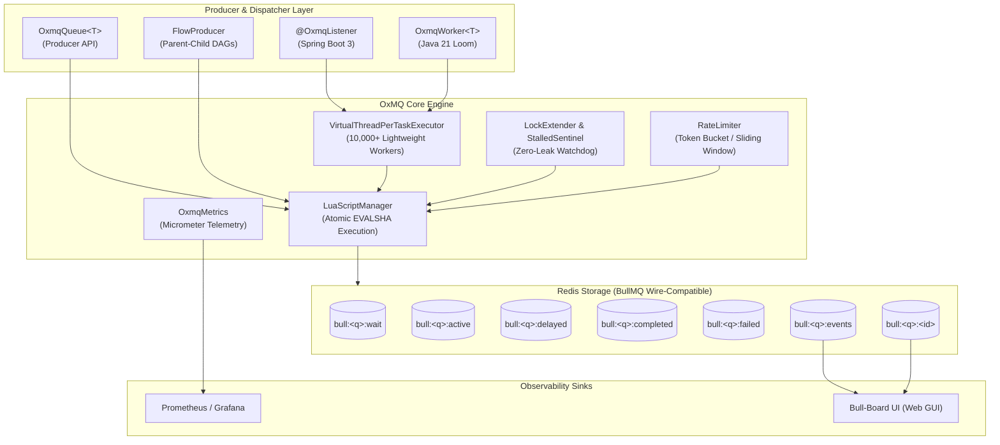
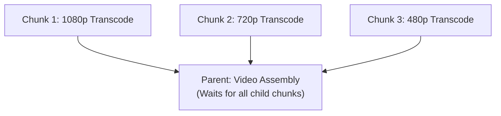

# 🐂 OxMQ

<p align="center">
  <b>High-Performance, Virtual Thread-Native Distributed Job Queue & DAG Workflow Engine for Java 21+</b><br/>
  <i>100% Open Source • BullMQ Wire-Compatible • Native Micrometer Telemetry • Zero-Config Spring Boot Starter</i>
</p>

<p align="center">
  <a href="https://opensource.org/licenses/Apache-2.0"></a>
  <a href="https://openjdk.org/projects/jdk/21/"></a>
  <a href="https://redis.io"></a>
  <a href="https://openjdk.org/projects/loom/"></a>
  <a href="https://bullmq.io/"></a>
</p>

---

## ⚡ Why OxMQ?

Modern Java microservices handle thousands of concurrent background jobs: sending webhooks, invoking LLM APIs, chunking data pipelines, and dispatching transactional emails. Traditional Java background job libraries either **poll relational databases with high latency**, **choke under OS thread-pool starvation**, or **lock essential enterprise features behind expensive commercial paywalls**.

**OxMQ** solves this permanently:

* **🚀 Virtual Thread Native (Project Loom):** Effortlessly execute **1,000+ to 10,000+ concurrent I/O-bound workers** on a single JVM node with near-zero memory footprint (< 2KB per task).
* **💯 100% Free & Open Source (No Paywalls):** Get Parent-Child DAG Workflows, Sliding-Window Rate Limiting, Dynamic Queues, and Sub-second Delays with zero paywalled tiers (unlike JobRunr Pro).
* **🌐 BullMQ Wire-Compatible:** Shared Redis key layout and Lua scripts allow Java, Node.js, and Python microservices to produce and consume jobs across the same Redis cluster, with instant compatibility with **[Bull-Board](https://github.com/felixmosh/bull-board)**.
* **📊 Native Performance Telemetry:** Built-in Micrometer instrumentation exposing counters, gauges, and high-precision latency distribution timers (`p50`, `p95`, `p99`) out-of-the-box for Prometheus and Grafana.
* **✨ Minimal Setup & Ergonomics:** Start producing and consuming jobs in under 5 lines of code.

---

## 📊 Feature Comparison Matrix

| Feature / Dimension | Quartz Scheduler | db-scheduler | JobRunr (Free / Pro) | Redisson RQueue | **🐂 OxMQ** |
| :--- | :--- | :--- | :--- | :--- | :--- |
| **Primary Storage** | JDBC / RDBMS | JDBC / RDBMS | Storage-Agnostic | Redis | **Pure Redis (6.2+ / 7.x)** |
| **Execution Latency** | Polling (1-5s) | Polling (1-5s) | Polling (1-5s) | Sub-millisecond | **Sub-millisecond (&lt; 1ms)** |
| **Throughput Target** | < 500 ops/s | < 1,000 ops/s | ~ 2,200 ops/s | ~ 18,000 ops/s | **&ge; 25,000 ops/s** |
| **Parent-Child DAGs** | ❌ No | ❌ No | 💳 **Paid Pro Only** | ❌ No | **✅ 100% Free / Native** |
| **Rate Limiting** | ❌ No | ❌ No | 💳 **Paid Pro Only** | ❌ Manual | **✅ 100% Free (Sliding Window)** |
| **Web Dashboard** | ❌ None | ❌ None | ✅ Included | ❌ None | **✅ Embedded + Bull-Board UI** |
| **Polyglot Interop** | ❌ Java only | ❌ Java only | ❌ Java only | ❌ Java only | **✅ Node.js / Python / Java** |
| **Concurrency Model** | Heavy OS Threads | Heavy OS Threads | Thread Pool | Thread Pool | **✅ Java 21 Virtual Threads (Loom)** |
| **Native Metrics** | ❌ Plugin | ❌ Plugin | ⚠️ Basic | ⚠️ Basic | **✅ Native Micrometer (p99 Timers)** |

---

## 🏛️ Architecture Overview



---

## 🚀 60-Second Quickstart

### 1. Add Dependency

```xml
<dependency>
    <groupId>io.oxmq</groupId>
    <artifactId>oxmq-core</artifactId>
    <version>1.0.0-SNAPSHOT</version>
</dependency>
```

### 2. Produce Jobs (5 Lines of Code)

```java
import io.oxmq.OxmqQueue;
import io.oxmq.model.JobOptions;
import java.time.Duration;

// Define payload record
public record EmailNotification(String to, String subject, String body) {}

// Initialize Queue
OxmqQueue<EmailNotification> queue = OxmqQueue.<EmailNotification>builder()
    .name("notifications")
    .redisUri("redis://localhost:6379")
    .build();

// Enqueue with 5s delay, 3 retries, exponential backoff
queue.add("welcome-email", new EmailNotification("alice@example.com", "Welcome!", "Hello Alice!"),
    JobOptions.builder()
        .delay(Duration.ofSeconds(5))
        .attempts(3)
        .exponentialBackoff(Duration.ofSeconds(1))
        .build());
```

### 3. Consume with Virtual Threads

```java
import io.oxmq.OxmqWorker;

// Initialize Worker with 100 Virtual Threads
OxmqWorker<EmailNotification> worker = OxmqWorker.<EmailNotification>builder()
    .queueName("notifications")
    .redisUri("redis://localhost:6379")
    .concurrency(100) // 100 concurrent Virtual Threads!
    .processor(job -> {
        job.updateProgress(50);
        job.log("Sending email to " + job.getData().to());
        // Blocking I/O call (HTTP, SMTP, DB) does NOT block OS carrier thread
        return "DELIVERED";
    })
    .build();

worker.start();
```

---

## 🍃 Spring Boot 3.x Starter

### 1. Add Starter Dependency

```xml
<dependency>
    <groupId>io.oxmq</groupId>
    <artifactId>oxmq-spring-boot-starter</artifactId>
    <version>1.0.0-SNAPSHOT</version>
</dependency>
```

### 2. Configure `application.yml`

```yaml
oxmq:
  redis:
    uri: redis://localhost:6379
  default-concurrency: 50
  virtual-threads: true
  metrics-enabled: true
```

### 3. Declarative `@OxmqListener`

```java
import io.oxmq.model.Job;
import io.oxmq.spring.annotation.EnableOxmq;
import io.oxmq.spring.annotation.OxmqListener;
import org.springframework.boot.SpringApplication;
import org.springframework.boot.autoconfigure.SpringBootApplication;
import org.springframework.stereotype.Component;

@SpringBootApplication
@EnableOxmq
public class Application {
    public static void main(String[] args) {
        SpringApplication.run(Application.class, args);
    }
}

@Component
public class NotificationWorker {

    @OxmqListener(queue = "notifications", concurrency = 100, rateLimitMax = 200, rateLimitDurationMs = 60000)
    public String processNotification(Job<EmailNotification> job) {
        job.updateProgress(50);
        // Process webhook / email / LLM call in a Virtual Thread
        return "SUCCESS";
    }
}
```

---

## 🌳 Parent-Child DAG Workflows (`FlowProducer`)

Build complex, multi-stage data pipelines where parent jobs automatically wait for child job completion and receive their aggregated return values:



```java
import io.oxmq.FlowProducer;
import io.oxmq.model.FlowJob;

FlowProducer flowProducer = new FlowProducer("redis://localhost:6379");

FlowJob<String> flow = FlowJob.of("video-encoder", "final-assembly-task")
    .addChild(FlowJob.of("video-encoder", "chunk-1-1080p"))
    .addChild(FlowJob.of("video-encoder", "chunk-2-720p"))
    .addChild(FlowJob.of("video-encoder", "chunk-3-480p"));

// Atomically enqueues tree into Redis
String parentJobId = flowProducer.add(flow);
```

---

## 🚦 Sliding-Window Rate Limiting

Prevent downstream API rate limits (e.g. Stripe, SendGrid, OpenAI) across distributed worker clusters:

```java
OxmqWorker<EmailPayload> worker = OxmqWorker.<EmailPayload>builder()
    .queueName("emails")
    .rateLimit(100, Duration.ofMinutes(1)) // Max 100 requests per minute
    .processor(job -> sendEmail(job.getData()))
    .build();
```

---

## 🖥️ Instant Bull-Board Web UI

Because OxMQ matches BullMQ's standard Redis schema, you can run Bull-Board with zero extra configuration:

```bash
npx @bull-board/cli --redis redis://localhost:6379 --queues notifications,webhooks,video-encoder
```

Navigate to `http://localhost:3000` to inspect queues, active jobs, retry failures, and view logs!

---

## 📊 Native Performance Telemetry (Micrometer)

OxMQ provides built-in metrics instrumentation with microsecond accuracy:

* **Counters:** `oxmq.jobs.enqueued`, `oxmq.jobs.completed`, `oxmq.jobs.failed`, `oxmq.jobs.retried`, `oxmq.jobs.stalled`
* **Gauges:** `oxmq.jobs.active`, `oxmq.jobs.waiting`, `oxmq.jobs.delayed`
* **Timers:** `oxmq.job.duration` (with `p50`, `p95`, `p99` percentiles), `oxmq.job.wait_time`

Access Prometheus metrics directly via `/actuator/prometheus` or integrate with Grafana.

---

## 📚 Consolidated Documentation & Roadmap

* 🏛️ **[Architecture & Internals](docs/ARCHITECTURE.md)**: Redis data structures, atomic Lua state machine, Virtual Thread concurrency model, and Mermaid diagrams.
* 📋 **[Product Requirements Document (PRD)](docs/PRD.md)**: Feature requirements, market comparison, and performance benchmarks ($\ge 25,000$ ops/sec).
* 🗺️ **[Roadmap](docs/ROADMAP.md)**: Release milestones from v0.1.0 to v1.0.0 GA.
* 📊 **[Master Progress Tracker](PROGRESS_TRACKER.md)**: Granular task status and live tracking.

---

## 📄 License

OxMQ is 100% free and open-source under the [Apache License 2.0](LICENSE).
