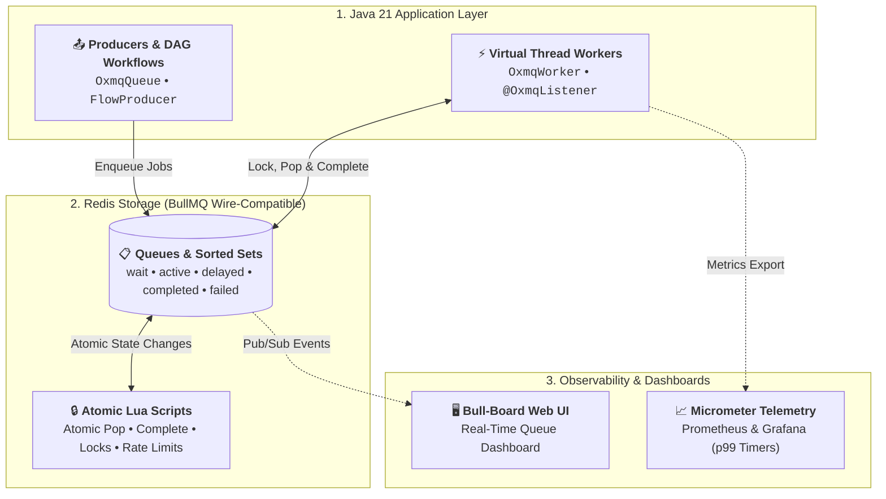

# 🐂 OxMQ

<p align="center">
  <b>High-Performance, Virtual Thread-Native Distributed Job Queue &amp; DAG Workflow Engine for Java 21+</b><br/>
  <i>100% Open Source (Apache 2.0) • BullMQ Wire-Compatible • Native Micrometer Telemetry • Batch Dequeue • Zero-Config Spring Boot 3</i>
</p>

<p align="center">
  <a href="https://github.com/gaurav10610/oxmq/actions/workflows/ci.yml"></a>
  <a href="https://opensource.org/licenses/Apache-2.0"></a>
  <a href="https://openjdk.org/projects/jdk/21/"></a>
  <a href="https://redis.io"></a>
  <a href="https://openjdk.org/projects/loom/"></a>
  <a href="https://bullmq.io/"></a>
  <a href="https://grafana.com/"></a>
</p>

---

## ⚡ Why OxMQ?

Modern Java microservices frequently handle high-volume background workloads: webhook delivery, third-party API integration (OpenAI, Stripe, SendGrid), multi-stage ETL/media transcoding pipelines, and high-throughput data ingestion into ClickHouse, PostgreSQL, or Elasticsearch.

In the Java ecosystem today, background job processing is fragmented:
1. **Relational Database Schedulers (Quartz, db-scheduler):** High-latency database polling (1–5 seconds), lock contention on relational tables, and low throughput (< 1,000 ops/s).
2. **Commercial Paywalls (JobRunr Pro):** Essential enterprise features like Parent-Child DAG workflows, sliding-window rate limiting, and dynamic queues are locked behind expensive commercial licenses.
3. **OS Thread Starvation:** Traditional thread pools consume 1MB+ of stack per thread and block underlying OS carrier threads during network/HTTP I/O.

**OxMQ is built to solve these gaps natively:**

* **🚀 Java 21 Virtual Threads (Project Loom):** Execute **1,000+ to 10,000+ concurrent I/O-bound workers** on a single JVM node with near-zero memory overhead (< 2KB per task) and no carrier thread blocking.
* **💯 100% Free & Open Source:** Full support for Parent-Child DAG Workflows, Sliding-Window Rate Limiting, Dynamic Queues, and Sub-second Delays with zero paywalled features.
* **🌐 BullMQ Wire-Compatible & Polyglot:** Direct interoperability with Node.js and Python microservices across the same Redis cluster, with out-of-the-box support for the **[Bull-Board UI](https://github.com/felixmosh/bull-board)** dashboard.
* **⚡ High-Throughput Batch Dequeue:** Bulk pop up to $N$ jobs atomically in 1 Redis roundtrip for high-performance database ingestion (ClickHouse, Elasticsearch, PostgreSQL batch inserts).
* **📊 Native Performance Telemetry:** Built-in Micrometer instrumentation exposing counters, gauges, and high-precision latency percentiles (`p50`, `p95`, `p99`) out-of-the-box for Prometheus and Grafana.

---

## 🌟 Top Features Supported by OxMQ

OxMQ combines the battle-tested, wire-compatible Redis data model of BullMQ with the massive concurrency of Java 21 Virtual Threads:

| Feature | Capability & Architecture | Key Developer Value |
| :--- | :--- | :--- |
| **🚀 Virtual Thread Concurrency** | Java 21 Project Loom native dispatcher (`OxmqWorker`) | **1,000+ to 10,000+ concurrent I/O workers** on a single node with $< 2\text{KB}$ stack and zero OS carrier thread blocking. |
| **🌲 Parent-Child DAG Workflows** | Atomic dependency tree resolution via `FlowProducer` | **100% Free & Open Source**: Parent tasks await parallel child completion with automatic result propagation and no commercial paywalls. |
| **⚡ High-Throughput Batch Dequeue** | Atomic bulk popping up to $N$ jobs (`OxmqBatchWorker`) | **$\ge 50,000\text{ ops/s}$ bulk ingestion** for ClickHouse, Elasticsearch, PostgreSQL (JDBC batch), and Snowflake in 1 Redis roundtrip. |
| **⏱️ Sliding-Window Rate Limiting** | Distributed token-bucket rate limiter (`rateLimit.lua`) | Protects external APIs (OpenAI, Stripe, Shopify, Twilio) from HTTP 429 rate limit bans across all cluster worker instances. |
| **🔄 Retries, Backoff & DLQ** | Exponential backoff with jitter & dead-letter queue | Automatic retry calculations with full exception stack traces captured and routed to Dead-Letter Queue (`bull:<q>:failed`). |
| **🎯 Sub-Second Delays & Dedup** | Atomic sorted set scheduling & custom `jobId` hashing | Millisecond-accurate delayed job triggers and debounced deduplication windows to prevent duplicate task execution. |
| **📡 Progress & Pub/Sub Events** | Real-time percentage progress & `QueueEvents` listener | Live percentage updates (`job.updateProgress(n)`), step logs, and Redis Pub/Sub event streaming for real-time WebSocket UIs. |
| **🌐 BullMQ Wire-Compatibility** | 100% identical BullMQ v5 Redis schema and data model | Seamless polyglot interop with Node.js and Python services, plus zero-config support for the **[Bull-Board Web UI](https://github.com/felixmosh/bull-board)**. |
| **📊 Native Micrometer Telemetry** | High-precision timers, counters, and queue gauges | Microsecond-accurate latency percentiles (`p50`, `p95`, `p99`) with pre-built Grafana dashboards and Prometheus endpoints. |
| **🍃 Spring Boot 3 Auto-Config** | Declarative `@EnableOxmq` and `@OxmqListener` annotations | Zero-config Spring Boot 3 starter with automatic worker lifecycle binding and `/actuator/health` indicator integration. |

---

## 🔄 How OxMQ Processes Jobs (Job Lifecycle & Auto-Retries)

At a glance, here is how jobs move through OxMQ—from enqueueing, atomic Lua state transitions, Virtual Thread dispatching, real-time progress streaming, to completion and exponential backoff retry loops:

<p align="center">
  
</p>

---

## 🏛️ System Architecture

OxMQ is built on a clean 3-tier architecture separating producers, consumers, atomic Redis storage, and observability sinks:



---

## 🚀 60-Second Quickstart

### 1. Add Dependency

```xml
<dependency>
    <groupId>io.oxmq</groupId>
    <artifactId>oxmq-core</artifactId>
    <version>1.0.0-SNAPSHOT</version>
</dependency>
```

### 2. Produce Jobs (5 Lines of Code)

```java
import io.oxmq.OxmqQueue;
import io.oxmq.model.JobOptions;
import java.time.Duration;

// 1. Define your payload (Java 21 Records natively supported)
public record EmailNotification(String to, String subject, String body) {}

// 2. Initialize Queue
OxmqQueue<EmailNotification> queue = OxmqQueue.<EmailNotification>builder()
    .name("notifications")
    .redisUri("redis://localhost:6379")
    .build();

// 3. Enqueue with 5s delay, 3 retries, and exponential backoff
queue.add("welcome-email", new EmailNotification("alice@example.com", "Welcome!", "Hello Alice!"),
    JobOptions.builder()
        .delay(Duration.ofSeconds(5))
        .attempts(3)
        .exponentialBackoff(Duration.ofSeconds(1))
        .build());
```

### 3. Consume with Virtual Threads

```java
import io.oxmq.OxmqWorker;

// Initialize Worker with 100 Virtual Threads
OxmqWorker<EmailNotification> worker = OxmqWorker.<EmailNotification>builder()
    .queueName("notifications")
    .redisUri("redis://localhost:6379")
    .concurrency(100) // 100 concurrent Virtual Threads!
    .processor(job -> {
        job.updateProgress(50);
        job.log("Dispatching email to " + job.getData().to());
        // Blocking I/O calls do NOT block OS carrier threads
        return "DELIVERED";
    })
    .build();

worker.start();
```

---

## 🍃 Spring Boot 3.x Starter

### 1. Add Starter Dependency

```xml
<dependency>
    <groupId>io.oxmq</groupId>
    <artifactId>oxmq-spring-boot-starter</artifactId>
    <version>1.0.0-SNAPSHOT</version>
</dependency>
```

### 2. Configure `application.yml`

```yaml
oxmq:
  redis:
    uri: redis://localhost:6379
  default-concurrency: 50
  virtual-threads: true
  metrics-enabled: true
```

### 3. Declarative `@OxmqListener`

```java
import io.oxmq.model.Job;
import io.oxmq.spring.annotation.EnableOxmq;
import io.oxmq.spring.annotation.OxmqListener;
import org.springframework.boot.SpringApplication;
import org.springframework.boot.autoconfigure.SpringBootApplication;
import org.springframework.stereotype.Component;

@SpringBootApplication
@EnableOxmq
public class Application {
    public static void main(String[] args) {
        SpringApplication.run(Application.class, args);
    }
}

@Component
public class NotificationWorker {

    @OxmqListener(queue = "notifications", concurrency = 100, rateLimitMax = 200, rateLimitDurationMs = 60000)
    public String processNotification(Job<EmailNotification> job) {
        job.updateProgress(50);
        // Process webhook / email / LLM call in a Virtual Thread
        return "SUCCESS";
    }
}
```

---

## 📚 Real-World Recipes & Examples (`oxmq-examples/`)

Runnable recipes covering production-grade patterns are organized into dedicated sub-projects in [`oxmq-examples/`](oxmq-examples/):

1. **[Standalone Quickstart](oxmq-examples/oxmq-example-standalone/src/main/java/io/oxmq/example/standalone/StandaloneQuickstartApplication.java):** 5-line pure Java 21 producer and Virtual Thread consumer quickstart.
2. **[Rate Limiting & Throttling](oxmq-examples/oxmq-example-rate-limiting/src/main/java/io/oxmq/example/ratelimit/RateLimitingExample.java):** Enforces sliding-window token-bucket limits to protect third-party APIs (e.g. OpenAI / Stripe rate limits).
3. **[Retries, Exponential Backoff & DLQ](oxmq-examples/oxmq-example-retries-dlq/src/main/java/io/oxmq/example/retries/RetriesAndDlqExample.java):** Automatic retry calculation with jitter and permanent dead-letter queue routing.
4. **[Parent-Child DAG Workflows](oxmq-examples/oxmq-example-dag-workflows/src/main/java/io/oxmq/example/dag/DagWorkflowExample.java):** Multi-stage media / ETL pipeline using `FlowProducer` where parent tasks await parallel child completion.
5. **[Batch Dequeue & Bulk Ingestion](oxmq-examples/oxmq-example-batch-ingestion/src/main/java/io/oxmq/example/batch/BatchDatabaseIngestionExample.java):** Bulk popping up to 100 jobs at once for fast ClickHouse, Elasticsearch, or PostgreSQL ingestion.
6. **[Scheduled Delays & Deduplication](oxmq-examples/oxmq-example-scheduled-dedup/src/main/java/io/oxmq/example/scheduled/ScheduledAndDedupExample.java):** Millisecond-accurate scheduling and custom `jobId` deduplication.
7. **[Real-Time Progress & Event Streaming](oxmq-examples/oxmq-example-progress-events/src/main/java/io/oxmq/example/progress/ProgressAndEventsExample.java):** `QueueEvents` Pub/Sub listener for real-time lifecycle tracking.
8. **[Spring Boot 3 Webhook Service](oxmq-examples/oxmq-example-spring-boot/src/main/java/io/oxmq/example/spring/SpringBootExampleApplication.java):** REST webhook dispatcher with `@OxmqListener` and Actuator health metrics.

---

## 🐳 Turn-Key Local Stack (1-Line Docker Compose)

Spin up Redis 7, Bull-Board UI, Prometheus, and Grafana with pre-provisioned OxMQ dashboards in one command:

```bash
docker compose up -d
```

| Service | Local URL | Default Credentials | Purpose |
| :--- | :--- | :--- | :--- |
| **Bull-Board Web UI** | `http://localhost:3000` | None | Real-time queue inspection, manual retries, step logs |
| **Grafana Dashboards** | `http://localhost:3001` | `admin` / `admin` | Pre-configured throughput, p99 latency, and error dashboards |
| **Prometheus** | `http://localhost:9090` | None | Raw metrics scraper and PromQL console |
| **Redis 7** | `localhost:6379` | None | Persistent Redis state store with AOF |

---

## 🖥️ Instant Bull-Board Web UI

Because OxMQ matches BullMQ's standard Redis schema, you can also run Bull-Board standalone via `npx`:

```bash
npx @bull-board/cli --redis redis://localhost:6379 --queues notifications,outgoing-webhooks,video-chunks,audit-logs
```

Navigate to `http://localhost:3000` to inspect queues, active jobs, retry failures, and view step logs!

---

## 📊 Native Performance Telemetry (Micrometer)

OxMQ provides built-in metrics instrumentation with microsecond accuracy:

* **Counters:** `oxmq.jobs.enqueued`, `oxmq.jobs.completed`, `oxmq.jobs.failed`, `oxmq.jobs.retried`, `oxmq.jobs.stalled`
* **Gauges:** `oxmq.jobs.active`, `oxmq.jobs.waiting`, `oxmq.jobs.delayed`
* **Timers:** `oxmq.job.duration` (with `p50`, `p95`, `p99` percentiles), `oxmq.job.wait_time`

Access Prometheus metrics directly via `/actuator/prometheus` or view them on Grafana.

---

## 📖 Deep-Dive Guides & Documentation

Explore our comprehensive technical guides in [`docs/`](docs/):

* 🚀 **[Getting Started Guide](docs/GETTING_STARTED.md)**: 0-to-1 setup for pure Java and Spring Boot 3.
* 🌲 **[Parent-Child DAG Workflows](docs/DAG_WORKFLOWS.md)**: Multi-stage pipelines, `FlowProducer`, and dependency resolution.
* ⚡ **[High-Throughput Batch Ingestion](docs/BATCH_INGESTION.md)**: `OxmqBatchWorker` for bulk ClickHouse, Postgres & Elasticsearch writes.
* ⏱️ **[Sliding-Window Rate Limiting](docs/RATE_LIMITING.md)**: Token-bucket rate limiting for OpenAI, Stripe, and third-party APIs.
* 🧩 **[Extensibility & SPI Architecture](docs/EXTENSIBILITY.md)**: Pluggable serializers (Avro/Protobuf), custom backoffs, tracing middleware, and telemetry sinks.
* 🍃 **[Spring Boot 3 Deep-Dive](docs/SPRING_BOOT.md)**: Auto-configuration, `@OxmqListener`, Actuator health, and metrics.
* 📊 **[Observability & Metrics](docs/OBSERVABILITY.md)**: Micrometer, Prometheus, Grafana, and `QueueEvents` Pub/Sub.
* ⚖️ **[Architectural Comparison](docs/COMPARISON.md)**: In-depth comparison of OxMQ vs BullMQ, JobRunr Pro, Quartz, Kafka, and RabbitMQ.
* 🛡️ **[Production Hardening Checklist](docs/PRODUCTION_CHECKLIST.md)**: Redis configuration, memory sizing, Sentinel/Cluster, and Kubernetes graceful shutdown.
* 🏛️ **[Architecture & Internals](docs/ARCHITECTURE.md)**: Redis data structures, atomic Lua state machine, and Virtual Thread concurrency model.
* 📋 **[Product Requirements Document (PRD)](docs/PRD.md)**: Specifications, market analysis, and benchmark goals ($\ge 25,000$ ops/sec).
* 🗺️ **[Master Roadmap](docs/ROADMAP.md)**: Release milestones from v0.1.0 to v1.0.0 GA.
* 🤝 **[Contributing Guidelines](CONTRIBUTING.md)**: Developer setup, code conventions, and pull request workflow.

---

## 📄 License

OxMQ is 100% free and open-source under the [Apache License 2.0](LICENSE).
