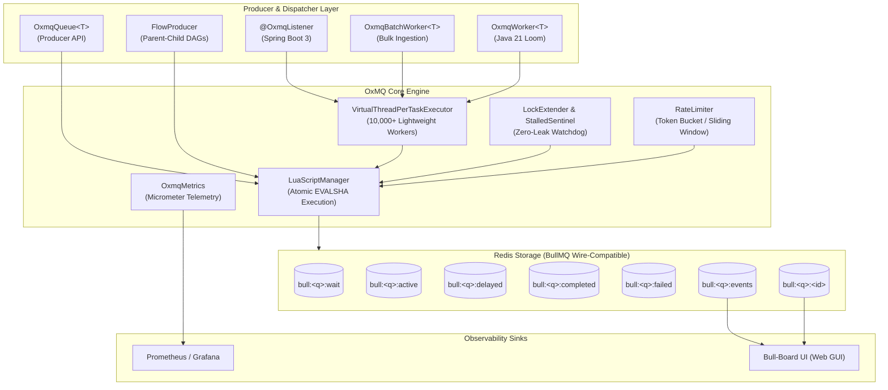

# 🐂 OxMQ

<p align="center">
  <b>High-Performance, Virtual Thread-Native Distributed Job Queue &amp; DAG Workflow Engine for Java 21+</b><br/>
  <i>100% Open Source (Apache 2.0) • BullMQ Wire-Compatible • Native Micrometer Telemetry • Batch Dequeue • Zero-Config Spring Boot 3</i>
</p>

<p align="center">
  <a href="https://opensource.org/licenses/Apache-2.0"></a>
  <a href="https://openjdk.org/projects/jdk/21/"></a>
  <a href="https://redis.io"></a>
  <a href="https://openjdk.org/projects/loom/"></a>
  <a href="https://bullmq.io/"></a>
</p>

---

## ⚡ Why OxMQ?

Modern Java microservices frequently handle high-volume background workloads: webhook delivery, third-party API integration (OpenAI, Stripe, SendGrid), multi-stage ETL/media transcoding pipelines, and high-throughput data ingestion into ClickHouse, PostgreSQL, or Elasticsearch.

In the Java ecosystem today, background job processing is fragmented:
1. **Relational Database Schedulers (Quartz, db-scheduler):** High-latency database polling (1–5 seconds), lock contention on relational tables, and low throughput (< 1,000 ops/s).
2. **Commercial Paywalls (JobRunr Pro):** Essential enterprise features like Parent-Child DAG workflows, sliding-window rate limiting, and dynamic queues are locked behind expensive commercial licenses.
3. **OS Thread Starvation:** Traditional thread pools consume 1MB+ of stack per thread and block underlying OS carrier threads during network/HTTP I/O.

**OxMQ is built to solve these gaps natively:**

* **🚀 Java 21 Virtual Threads (Project Loom):** Execute **1,000+ to 10,000+ concurrent I/O-bound workers** on a single JVM node with near-zero memory overhead (< 2KB per task) and no carrier thread blocking.
* **💯 100% Free & Open Source:** Full support for Parent-Child DAG Workflows, Sliding-Window Rate Limiting, Dynamic Queues, and Sub-second Delays with zero paywalled features.
* **🌐 BullMQ Wire-Compatible & Polyglot:** Direct interoperability with Node.js and Python microservices across the same Redis cluster, with out-of-the-box support for the **[Bull-Board UI](https://github.com/felixmosh/bull-board)** dashboard.
* **⚡ High-Throughput Batch Dequeue:** Bulk pop up to $N$ jobs atomically in 1 Redis roundtrip for high-performance database ingestion (ClickHouse, Elasticsearch, PostgreSQL batch inserts).
* **📊 Native Performance Telemetry:** Built-in Micrometer instrumentation exposing counters, gauges, and high-precision latency percentiles (`p50`, `p95`, `p99`) out-of-the-box for Prometheus and Grafana.

---

## 🌟 Top Features Supported by OxMQ

OxMQ combines the battle-tested, wire-compatible Redis data model of BullMQ with the massive concurrency of Java 21 Virtual Threads:

* **🚀 Java 21 Virtual Thread Concurrency (Project Loom):** Execute **1,000+ to 10,000+ concurrent I/O-bound workers** on a single JVM node with near-zero memory overhead (< 2KB stack per task) without thread starvation or carrier thread blocking.
* **🌲 Parent-Child DAG Workflows (`FlowProducer`):** Native multi-stage dependency trees where parent tasks await parallel child completion, propagating child outputs upstream with zero paid paywalls.
* **⚡ High-Throughput Batch Dequeue (`OxmqBatchWorker`):** Bulk pop up to $N$ jobs atomically in 1 Redis roundtrip for high-performance database ingestion into ClickHouse, Elasticsearch, PostgreSQL, or Snowflake.
* **⏱️ Sliding-Window Rate Limiting & Throttling:** Built-in token-bucket rate limiting to safeguard external APIs (OpenAI, Stripe, SendGrid) without dropping jobs.
* **🔄 Exponential Backoff Retries & Dead-Letter Queue (DLQ):** Configurable retry attempts with exponential backoff & jitter calculations, automatically routing permanently failed jobs to a dead-letter state with full stack traces.
* **🎯 Sub-Second Scheduled Delays & Deduplication:** Millisecond-accurate delayed execution and custom `jobId` debounce windows to prevent duplicate processing.
* **📡 Real-Time Progress Updates & Event Streaming (`QueueEvents`):** Live percentage progress reporting (`job.updateProgress(n)`), step logs (`job.log(msg)`), and Redis Pub/Sub lifecycle streaming.
* **🌐 100% BullMQ Wire-Compatibility & Polyglot Interop:** Identical Redis schema to BullMQ v5, allowing seamless interop with Node.js and Python microservices, plus zero-config support for the **[Bull-Board Web UI](https://github.com/felixmosh/bull-board)** dashboard.
* **📊 Native Micrometer Performance Telemetry:** Microsecond-accurate latency percentiles (`p50`, `p95`, `p99`), counters, and gauges for Prometheus, Grafana, and Datadog out-of-the-box.
* **🍃 Zero-Config Spring Boot 3 Integration:** Declarative `@EnableOxmq` and `@OxmqListener` annotations with Spring Boot Actuator health checks and auto-configuration.

---

## 🔄 How OxMQ Processes Jobs (Job Lifecycle)

The diagram below illustrates the end-to-end lifecycle of a job—from enqueueing, sliding-window rate limit checks, atomic lock acquisition, Java 21 Virtual Thread dispatching, real-time progress streaming, to completion or exponential backoff retries:

```mermaid
flowchart TD
    subgraph Ingestion["1. Enqueue &amp; Scheduling"]
        Producer["OxmqQueue.add() / FlowProducer"] -->|Atomic EVALSHA| AddLua["addJob.lua"]
        AddLua -->|Immediate Job| WaitList[("bull:&lt;q&gt;:wait<br/>(Ready List)")]
        AddLua -->|Delayed / Retry| DelayedZSet[("bull:&lt;q&gt;:delayed<br/>(Timestamp Sorted Set)")]
        DelayedZSet -.->|Timestamp Matured| WaitList
    end

    subgraph Acquisition["2. Acquisition &amp; Rate Limiting"]
        Poller["OxmqWorker Poller Loop"] --> RateCheck{"RateLimiter<br/>Token Bucket OK?"}
        RateCheck -->|Within Limit| PopLua["moveToActive.lua<br/>(Atomic Pop &amp; Lock Lease)"]
        RateCheck -->|Rate Limited| ThrottleSleep["Backoff &amp; Wait (ms)"]
        WaitList --> PopLua
        PopLua --> ActiveZSet[("bull:&lt;q&gt;:active<br/>(Leased Job Lock)")]
    end

    subgraph Dispatch["3. Java 21 Loom Execution"]
        PopLua --> Dispatcher["VirtualThreadPerTaskExecutor<br/>(Thread.ofVirtual())"]
        Dispatcher --> WorkerThread["Worker Virtual Thread<br/>(JobProcessor.process)"]
        
        WorkerThread -.->|job.updateProgress(%)| PubSub[("bull:&lt;q&gt;:events<br/>(Redis Pub/Sub)")]
        WorkerThread -.->|job.log(msg)| JobLogs[("bull:&lt;q&gt;:&lt;id&gt;:logs")]
        
        Heartbeat["LockExtender (Heartbeat)"] -.->|Renew Lock Lease| ActiveZSet
        Watchdog["StalledJobSentinel"] -.->|Rescue Crashed/Orphaned| WaitList
    end

    subgraph Completion["4. Completion, Retries &amp; DLQ"]
        WorkerThread --> ResultCheck{"Execution Result?"}
        
        ResultCheck -->|Success| FinishLua["moveToFinished.lua<br/>(State: COMPLETED)"]
        FinishLua --> CompletedZSet[("bull:&lt;q&gt;:completed")]
        FinishLua -.->|Propagate Child Results| ParentDAG["Parent DAG Flow"]
        
        ResultCheck -->|Failure &amp; Retries Left| RetryLua["retryJob.lua<br/>(Exponential Backoff + Jitter)"]
        RetryLua --> DelayedZSet
        
        ResultCheck -->|Failure &amp; Max Attempts| FailLua["moveToFinished.lua<br/>(State: FAILED / DLQ)"]
        FailLua --> FailedZSet[("bull:&lt;q&gt;:failed<br/>(Dead-Letter Queue)")]
    end

    subgraph Observability["5. Telemetry &amp; Monitoring"]
        FinishLua --> Metrics["OxmqMetrics (Micrometer)"]
        FailLua --> Metrics
        PubSub --> BullBoard["Bull-Board UI / WebSockets"]
    end
```

---

## 🏛️ System Architecture



---

## 🚀 60-Second Quickstart

### 1. Add Dependency

```xml
<dependency>
    <groupId>io.oxmq</groupId>
    <artifactId>oxmq-core</artifactId>
    <version>1.0.0-SNAPSHOT</version>
</dependency>
```

### 2. Produce Jobs (5 Lines of Code)

```java
import io.oxmq.OxmqQueue;
import io.oxmq.model.JobOptions;
import java.time.Duration;

// 1. Define your payload (Java 21 Records natively supported)
public record EmailNotification(String to, String subject, String body) {}

// 2. Initialize Queue
OxmqQueue<EmailNotification> queue = OxmqQueue.<EmailNotification>builder()
    .name("notifications")
    .redisUri("redis://localhost:6379")
    .build();

// 3. Enqueue with 5s delay, 3 retries, and exponential backoff
queue.add("welcome-email", new EmailNotification("alice@example.com", "Welcome!", "Hello Alice!"),
    JobOptions.builder()
        .delay(Duration.ofSeconds(5))
        .attempts(3)
        .exponentialBackoff(Duration.ofSeconds(1))
        .build());
```

### 3. Consume with Virtual Threads

```java
import io.oxmq.OxmqWorker;

// Initialize Worker with 100 Virtual Threads
OxmqWorker<EmailNotification> worker = OxmqWorker.<EmailNotification>builder()
    .queueName("notifications")
    .redisUri("redis://localhost:6379")
    .concurrency(100) // 100 concurrent Virtual Threads!
    .processor(job -> {
        job.updateProgress(50);
        job.log("Dispatching email to " + job.getData().to());
        // Blocking I/O calls do NOT block OS carrier threads
        return "DELIVERED";
    })
    .build();

worker.start();
```

---

## 🍃 Spring Boot 3.x Starter

### 1. Add Starter Dependency

```xml
<dependency>
    <groupId>io.oxmq</groupId>
    <artifactId>oxmq-spring-boot-starter</artifactId>
    <version>1.0.0-SNAPSHOT</version>
</dependency>
```

### 2. Configure `application.yml`

```yaml
oxmq:
  redis:
    uri: redis://localhost:6379
  default-concurrency: 50
  virtual-threads: true
  metrics-enabled: true
```

### 3. Declarative `@OxmqListener`

```java
import io.oxmq.model.Job;
import io.oxmq.spring.annotation.EnableOxmq;
import io.oxmq.spring.annotation.OxmqListener;
import org.springframework.boot.SpringApplication;
import org.springframework.boot.autoconfigure.SpringBootApplication;
import org.springframework.stereotype.Component;

@SpringBootApplication
@EnableOxmq
public class Application {
    public static void main(String[] args) {
        SpringApplication.run(Application.class, args);
    }
}

@Component
public class NotificationWorker {

    @OxmqListener(queue = "notifications", concurrency = 100, rateLimitMax = 200, rateLimitDurationMs = 60000)
    public String processNotification(Job<EmailNotification> job) {
        job.updateProgress(50);
        // Process webhook / email / LLM call in a Virtual Thread
        return "SUCCESS";
    }
}
```

---

## 📚 Real-World Recipes & Examples (`oxmq-examples/`)

Runnable recipes covering production-grade patterns are organized into dedicated sub-projects in [`oxmq-examples/`](oxmq-examples/):

1. **[Standalone Quickstart](oxmq-examples/oxmq-example-standalone/src/main/java/io/oxmq/example/standalone/StandaloneQuickstartApplication.java):** 5-line pure Java 21 producer and Virtual Thread consumer quickstart.
2. **[Rate Limiting & Throttling](oxmq-examples/oxmq-example-rate-limiting/src/main/java/io/oxmq/example/ratelimit/RateLimitingExample.java):** Enforces sliding-window token-bucket limits to protect third-party APIs (e.g. OpenAI / Stripe rate limits).
3. **[Retries, Exponential Backoff & DLQ](oxmq-examples/oxmq-example-retries-dlq/src/main/java/io/oxmq/example/retries/RetriesAndDlqExample.java):** Automatic retry calculation with jitter and permanent dead-letter queue routing.
4. **[Parent-Child DAG Workflows](oxmq-examples/oxmq-example-dag-workflows/src/main/java/io/oxmq/example/dag/DagWorkflowExample.java):** Multi-stage media / ETL pipeline using `FlowProducer` where parent tasks await parallel child completion.
5. **[Batch Dequeue & Bulk Ingestion](oxmq-examples/oxmq-example-batch-ingestion/src/main/java/io/oxmq/example/batch/BatchDatabaseIngestionExample.java):** Bulk popping up to 100 jobs at once for fast ClickHouse, Elasticsearch, or PostgreSQL ingestion.
6. **[Scheduled Delays & Deduplication](oxmq-examples/oxmq-example-scheduled-dedup/src/main/java/io/oxmq/example/scheduled/ScheduledAndDedupExample.java):** Millisecond-accurate scheduling and custom `jobId` deduplication.
7. **[Real-Time Progress & Event Streaming](oxmq-examples/oxmq-example-progress-events/src/main/java/io/oxmq/example/progress/ProgressAndEventsExample.java):** `QueueEvents` Pub/Sub listener for real-time lifecycle tracking.
8. **[Spring Boot 3 Webhook Service](oxmq-examples/oxmq-example-spring-boot/src/main/java/io/oxmq/example/spring/SpringBootExampleApplication.java):** REST webhook dispatcher with `@OxmqListener` and Actuator health metrics.

---

## 🖥️ Instant Bull-Board Web UI

Because OxMQ matches BullMQ's standard Redis schema, you can run Bull-Board with zero extra configuration:

```bash
npx @bull-board/cli --redis redis://localhost:6379 --queues notifications,video-chunks,audit-log-ingestion
```

Navigate to `http://localhost:3000` to inspect queues, active jobs, retry failures, and view step logs!

---

## 📊 Native Performance Telemetry (Micrometer)

OxMQ provides built-in metrics instrumentation with microsecond accuracy:

* **Counters:** `oxmq.jobs.enqueued`, `oxmq.jobs.completed`, `oxmq.jobs.failed`, `oxmq.jobs.retried`, `oxmq.jobs.stalled`
* **Gauges:** `oxmq.jobs.active`, `oxmq.jobs.waiting`, `oxmq.jobs.delayed`
* **Timers:** `oxmq.job.duration` (with `p50`, `p95`, `p99` percentiles), `oxmq.job.wait_time`

Access Prometheus metrics directly via `/actuator/prometheus` or integrate with Grafana.

---

## 📖 Documentation & Roadmap

* 🏛️ **[Architecture & Internals](docs/ARCHITECTURE.md)**: Redis data structures, atomic Lua state machine, Virtual Thread concurrency model, and Mermaid diagrams.
* 📋 **[Product Requirements Document (PRD)](docs/PRD.md)**: Grounded specifications, market comparison, and performance benchmarks ($\ge 25,000$ ops/sec).
* 🗺️ **[Master Roadmap](docs/ROADMAP.md)**: Detailed milestone release plan (v0.1.0 to v1.0.0 GA).
* 📊 **[Master Progress Tracker](PROGRESS_TRACKER.md)**: Live task status and line-item checklists.

---

## 📄 License

OxMQ is 100% free and open-source under the [Apache License 2.0](LICENSE).
