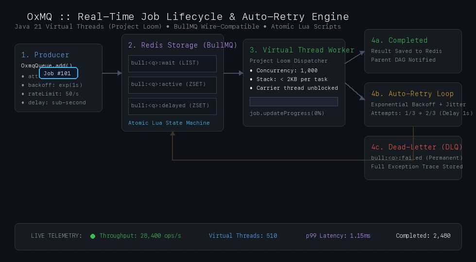
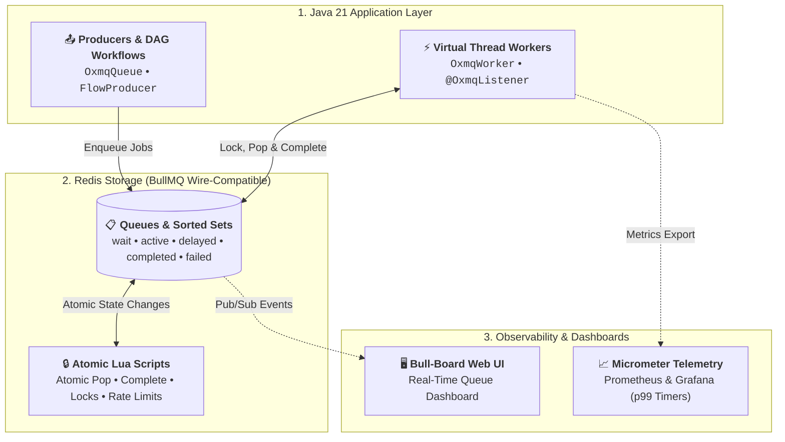

<p align="center">
  
</p>

<h1 align="center" style="font-size: 2.8rem; font-weight: 800; margin-top: 0.5rem; margin-bottom: 0.5rem; letter-spacing: -0.5px;">OxMQ</h1>

<p align="center">
  <b>The High-Performance, Virtual Thread-Native Distributed Job Queue &amp; DAG Workflow Engine for Java 21+</b><br/>
  <i>The BullMQ of Java • 100% Free &amp; Open Source (Apache 2.0) • Native Bull-Board UI Parity • Batch Dequeue • Zero-Config Spring Boot 3</i>
</p>

<p align="center">
  <a href="https://github.com/gaurav10610/oxmq/releases/tag/v1.0.0"></a>
  <a href="https://jitpack.io/#gaurav10610/oxmq"></a>
  <a href="https://opensource.org/licenses/Apache-2.0"></a>
  <a href="https://openjdk.org/projects/jdk/21/"></a>
  <a href="https://spring.io/projects/spring-boot"></a>
  <a href="https://redis.io"></a>
  <a href="https://openjdk.org/projects/loom/"></a>
  <a href="https://bullmq.io/"></a>
  <a href="https://grafana.com/"></a>
</p>

---

## ⚡ Why OxMQ? The Missing Distributed Job Queue for Java

Every major engineering ecosystem has an undisputed gold standard for background job processing and task queue orchestration:
* **Python** has **Celery**
* **Node.js** has **BullMQ**
* **Go** has **Asynq**

**What about Java?**  
Until now, Java microservices have been stuck between three painful compromises:
1. **Overkill Event Streams (Kafka / RabbitMQ):** Event streaming brokers excel at raw pub/sub, but **lack native job lifecycle primitives**: no per-job delayed scheduling, no individual job retries with exponential backoff, no parent-child DAG completion tracking, no step progress reporting, and no out-of-the-box management dashboard.
2. **Relational Database Schedulers (Quartz, db-scheduler):** Rely on polling relational tables (`SELECT ... FOR UPDATE`) every 1–5 seconds, causing severe SQL lock contention, high database load, and sluggish throughput ($< 1,000\text{ ops/s}$).
3. **Commercial Paywalls (JobRunr Pro):** Essential enterprise features like Parent-Child DAG workflows, sliding-window rate limiting, and dynamic batching are locked behind expensive commercial paywalls ($99+/month).
4. **OS Thread Starvation:** Traditional thread pools consume 1MB+ of stack per thread, causing JVMs to hit resource limits when executing hundreds of blocking HTTP, database, or LLM calls.

---

## 🐂 The OxMQ Breakthrough

**OxMQ brings the gold standard of BullMQ to Java 21 Project Loom (Virtual Threads) and Redis:**

* **🧵 Java 21 Virtual Threads (Project Loom):** Execute **1,000+ to 10,000+ concurrent I/O-bound workers** per JVM node with $< 2\text{KB}$ memory per task and zero OS carrier thread blocking.
* **💯 100% Free & Open Source (Apache 2.0):** Complex Parent-Child DAG Workflows, Sliding-Window Token-Bucket Rate Limiting, Dynamic Queues, and Sub-second Delays with zero paywalls.
* **⚡ High-Throughput Batch Dequeue:** Bulk pop up to $N$ jobs atomically in 1 Redis roundtrip for high-performance database ingestion (ClickHouse, Elasticsearch, PostgreSQL batch inserts at $\ge 50,000\text{ ops/s}$).
* **🌐 BullMQ Wire-Compatibility:** Uses BullMQ's standard Redis schema for seamless polyglot interoperability (Java $\leftrightarrow$ Node.js $\leftrightarrow$ Python) and **instant compatibility with the [Bull-Board Web UI](https://github.com/felixmosh/bull-board)**.
* **🍃 Zero-Config Spring Boot 3 Starter:** Declarative `@OxmqListener` annotations, automated worker lifecycle management, Actuator health checks, and native Micrometer telemetry out-of-the-box.

---

## 🌟 Core Capabilities & Feature Matrix

| Feature | Architecture & Implementation | Key Developer Value |
| :--- | :--- | :--- |
| **🚀 Virtual Thread Concurrency** | Java 21 Project Loom native dispatcher (`OxmqWorker`) | **10,000+ concurrent I/O workers** on a single node with $< 2\text{KB}$ memory per task and zero OS thread pool starvation. |
| **🌲 Parent-Child DAG Workflows** | Atomic dependency tree resolution via `FlowProducer` | **100% Free & Open Source**: Parent jobs await parallel child completion with automatic return value propagation. |
| **⚡ High-Throughput Batch Dequeue** | Atomic bulk popping up to $N$ jobs (`OxmqBatchWorker`) | **$\ge 50,000\text{ ops/s}$ bulk ingestion** for ClickHouse, Elasticsearch, PostgreSQL (JDBC batch), and Snowflake in 1 Redis roundtrip. |
| **⏱️ Sliding-Window Rate Limiting** | Distributed token-bucket rate limiter (`rateLimit.lua`) | Protects external APIs (OpenAI, Stripe, Shopify, Twilio) from HTTP 429 rate limit bans across all cluster instances. |
| **🔄 Retries, Backoff & DLQ** | Exponential backoff with jitter & dead-letter queue | Automatic retry calculations with full exception stack traces captured and routed to Dead-Letter Queue (`bull:<q>:failed`). |
| **🎯 Sub-Second Delays & Dedup** | Atomic sorted set scheduling & custom `jobId` hashing | Millisecond-accurate delayed job triggers and debounced deduplication windows to prevent duplicate execution. |
| **📡 Progress & Pub/Sub Events** | Real-time percentage progress & `QueueEvents` listener | Live percentage updates (`job.updateProgress(n)`), step logs, and Redis Pub/Sub event streaming for real-time WebSocket UIs. |
| **🌐 BullMQ Wire-Compatibility** | 100% identical BullMQ v5 Redis schema and data model | Seamless polyglot interop with Node.js and Python services, plus zero-config support for the **[Bull-Board Web UI](https://github.com/felixmosh/bull-board)**. |
| **📊 Native Micrometer Telemetry** | High-precision timers, counters, and queue gauges | Microsecond-accurate latency percentiles (`p50`, `p95`, `p99`) with pre-built Grafana dashboards and Prometheus endpoints. |
| **🍃 Spring Boot 3 Auto-Config** | Declarative `@EnableOxmq` and `@OxmqListener` annotations | Zero-config Spring Boot 3 starter with automatic worker lifecycle binding and `/actuator/health` indicator integration. |

---

## 🔄 How OxMQ Processes Jobs (Job Lifecycle & Auto-Retries)

Jobs transition atomically across Redis lists and sorted sets via single-roundtrip Lua scripts, accompanied by real-time progress streaming and exponential backoff retry loops:

<p align="center">
  
</p>

---

## 🏛️ System Architecture

OxMQ is designed with a clean 3-tier separation:



---

## 📦 Installation

Add OxMQ to your project using **JitPack** or download the pre-packaged JARs from [GitHub Releases](https://github.com/gaurav10610/oxmq/releases/tag/v1.0.0):

### Maven (`pom.xml`)

```xml
<repositories>
    <repository>
        <id>jitpack.io</id>
        <url>https://jitpack.io</url>
    </repository>
</repositories>

<dependencies>
    <!-- Core Pure Java Engine (Virtual Threads + Redis) -->
    <dependency>
        <groupId>com.github.gaurav10610.oxmq</groupId>
        <artifactId>oxmq-core</artifactId>
        <version>v1.0.0</version>
    </dependency>

    <!-- Optional: Spring Boot 3 Starter (@OxmqListener, Actuator) -->
    <dependency>
        <groupId>com.github.gaurav10610.oxmq</groupId>
        <artifactId>oxmq-spring-boot-starter</artifactId>
        <version>v1.0.0</version>
    </dependency>
</dependencies>
```

### Gradle (`build.gradle.kts`)

```kotlin
repositories {
    mavenCentral()
    maven { url = uri("https://jitpack.io") }
}

dependencies {
    implementation("com.github.gaurav10610.oxmq:oxmq-core:v1.0.0")
    // or for Spring Boot 3 microservices:
    // implementation("com.github.gaurav10610.oxmq:oxmq-spring-boot-starter:v1.0.0")
}
```

---

## 🚀 60-Second Quickstart

### 1. Produce Jobs (5 Lines of Code)

```java
import io.oxmq.OxmqQueue;
import io.oxmq.model.JobOptions;
import java.time.Duration;

// 1. Define your payload (Java 21 Records natively supported)
public record EmailNotification(String to, String subject, String body) {}

// 2. Initialize Queue
OxmqQueue<EmailNotification> queue = OxmqQueue.<EmailNotification>builder()
    .name("notifications")
    .redisUri("redis://localhost:6379")
    .build();

// 3. Enqueue with 5s delay, 3 retries, and exponential backoff
queue.add("welcome-email", new EmailNotification("alice@example.com", "Welcome!", "Hello Alice!"),
    JobOptions.builder()
        .delay(Duration.ofSeconds(5))
        .attempts(3)
        .exponentialBackoff(Duration.ofSeconds(1))
        .build());
```

### 2. Consume on Java 21 Virtual Threads

```java
import io.oxmq.OxmqWorker;

// Initialize Worker with 100 Virtual Threads
OxmqWorker<EmailNotification> worker = OxmqWorker.<EmailNotification>builder()
    .queueName("notifications")
    .redisUri("redis://localhost:6379")
    .concurrency(100) // 100 concurrent Virtual Threads!
    .processor(job -> {
        job.updateProgress(50);
        job.log("Dispatching email to " + job.getData().to());
        
        // Blocking I/O calls do NOT block underlying OS carrier threads!
        emailService.send(job.getData());
        return "DELIVERED";
    })
    .build();

worker.start();
```

---

## 🍃 Spring Boot 3 Starter (`oxmq-spring-boot-starter`)

OxMQ provides first-class, zero-boilerplate autoconfiguration for Spring Boot 3 microservices:

### 1. Configure `application.yml`

```yaml
oxmq:
  redis:
    uri: redis://localhost:6379
  default-concurrency: 50
  virtual-threads: true
  metrics-enabled: true
```

### 2. Declarative `@OxmqListener`

```java
@Component
public class NotificationWorker {

    @OxmqListener(queue = "notifications", concurrency = 100, rateLimitMax = 200, rateLimitDurationMs = 60000)
    public String processNotification(Job<EmailNotification> job) {
        job.updateProgress(50);
        // Process webhook, email, or LLM call on a lightweight Virtual Thread
        return "SUCCESS";
    }
}
```

---

## 🌲 Parent-Child DAG Workflows (`FlowProducer`)

Build complex multi-stage distributed pipelines where parent jobs automatically await parallel child completion:

```java
FlowProducer flowProducer = new FlowProducer("redis://localhost:6379");

// Define parallel child tasks
FlowJobNode child1 = FlowJobNode.builder()
    .queueName("video-chunks")
    .name("encode-1080p")
    .data(new VideoChunk("vid_1", "1080p"))
    .build();

FlowJobNode child2 = FlowJobNode.builder()
    .queueName("video-chunks")
    .name("encode-720p")
    .data(new VideoChunk("vid_1", "720p"))
    .build();

// Define parent assembly job waiting on children
FlowJobNode parentJob = FlowJobNode.builder()
    .queueName("video-assembly")
    .name("assemble-master")
    .data(new VideoAssembly("vid_1"))
    .children(List.of(child1, child2))
    .build();

// Atomically enqueue the DAG into Redis
flowProducer.add(parentJob);
```
*The parent job automatically enters `WAITING_CHILDREN` in Redis and triggers only when both 1080p and 720p encodings finish successfully!*

---

## 🎮 Flagship Showcase Application: `CloudBridge` (`oxmq-examples/cloudbridge/`)

[`cloudbridge`](oxmq-examples/cloudbridge/README.md) is a production-grade multi-cloud asset backup and sync application demonstrating 100% of OxMQ's capabilities in a unified real-world application:
* **Automated Cloud Backup Pipeline:** Scans repository file trees from **GitHub** $\rightarrow$ streams parallel file uploads to **Dropbox** (API v2) and **Box** (Content API) $\rightarrow$ compiles a parent cryptographic `SyncManifest`.
* **Parent-Child DAG Workflows (`FlowProducer`):** Parent orchestration task automatically fans out parallel child file transfers and resolves only when all transfers finish.
* **Java 21 Virtual Threads (Loom):** Worker concurrency running on lightweight Virtual Threads handling concurrent network streaming I/O with zero carrier-thread starvation.
* **Real-Time Interactive Web Dashboard (`http://localhost:8080`):** Modern UI with animated progress bars, live DAG execution graph from Redis, and embedded Bull-Board inspector.

```bash
# 1. Start Redis & Bull-Board
docker compose up -d

# 2. Start CloudBridge
./mvnw spring-boot:run -pl oxmq-examples/cloudbridge

# 3. Open Web Dashboard
open http://localhost:8080
```

---

## 🐳 Turn-Key Local Stack (1-Line Docker Compose)

Spin up Redis 7, Bull-Board UI, Prometheus, and Grafana with pre-provisioned OxMQ dashboards in one command:

```bash
docker compose up -d
```

| Service | Local URL | Default Credentials | Purpose |
| :--- | :--- | :--- | :--- |
| **Bull-Board Web UI** | `http://localhost:3000` | None | Real-time queue inspection, manual retries, step logs |
| **Grafana Dashboards** | `http://localhost:3001` | `admin` / `admin` | Pre-configured throughput, p99 latency, and error dashboards |
| **Prometheus** | `http://localhost:9090` | None | Raw metrics scraper and PromQL console |
| **Redis 7** | `localhost:6379` | None | Persistent Redis state store with AOF |

---

## 🖥️ Instant Bull-Board Web UI

Because OxMQ matches BullMQ's standard Redis schema, you can also run Bull-Board standalone via `npx`:

```bash
npx @bull-board/cli --redis redis://localhost:6379 --queues notifications,order-events,file-transfer-queue
```

Open `http://localhost:3000` to inspect queues, active jobs, retry failures, and view live step logs!

---

## ⚖️ Architectural Comparison

| Capability | 🐂 **OxMQ** (Java 21+) | 💼 **JobRunr** (Java) | ⏱️ **Quartz / DB-Scheduler** | 🐰 **RabbitMQ** | 📨 **Apache Kafka** |
| :--- | :---: | :---: | :---: | :---: | :---: |
| **Concurrency** | **Virtual Threads (Loom)** | Platform Threads (OS) | Platform Threads (OS) | Erlang Actors | Thread-per-partition |
| **Parent-Child DAGs** | ✅ **100% Free (Apache 2.0)** | ❌ **Paywalled ($99+/mo)** | ❌ None | ❌ Manual | ❌ External engine |
| **Rate Limiting** | ✅ **Built-in Token Bucket** | ❌ **Paywalled** | ❌ None | ⚠️ Plugin | ❌ None |
| **Batch Dequeue** | ✅ **$\ge 50,000$ ops/s** | ❌ None | ❌ None | ⚠️ Prefetch | ✅ Native batching |
| **Sub-Second Delays** | ✅ **Atomic ZSET (<1ms)** | ⚠️ Polling lag | ❌ 1–5s DB poll lag | ⚠️ Plugin trick | ❌ None |
| **Web Dashboard** | ✅ **Bull-Board UI** | ✅ JobRunr Dashboard | ❌ None | ✅ RabbitMQ Admin | ⚠️ Third-party |
| **License** | **Apache 2.0 (100% Free)** | LGPLv3 / **Commercial Pro** | Apache 2.0 | MPL 2.0 | Apache 2.0 |

*See our full [Architectural Comparison Guide](docs/COMPARISON.md) for deep dives on memory footprints, throughput benchmarks, and polyglot architectures.*

---

## 📖 Deep-Dive Guides & Documentation

Explore our comprehensive technical guides in [`docs/`](docs/):

* 🚀 **[Getting Started Guide](docs/GETTING_STARTED.md)**: 0-to-1 setup for pure Java and Spring Boot 3.
* 🌲 **[Parent-Child DAG Workflows](docs/DAG_WORKFLOWS.md)**: Multi-stage pipelines, `FlowProducer`, and dependency resolution.
* ⚡ **[High-Throughput Batch Ingestion](docs/BATCH_INGESTION.md)**: `OxmqBatchWorker` for bulk ClickHouse, Postgres & Elasticsearch writes.
* ⏱️ **[Sliding-Window Rate Limiting](docs/RATE_LIMITING.md)**: Token-bucket rate limiting for OpenAI, Stripe, and third-party APIs.
* 🧩 **[Extensibility & SPI Architecture](docs/EXTENSIBILITY.md)**: Pluggable serializers (Avro/Protobuf), custom backoffs, tracing middleware, and telemetry sinks.
* 🍃 **[Spring Boot 3 Deep-Dive](docs/SPRING_BOOT.md)**: Auto-configuration, `@OxmqListener`, Actuator health, and metrics.
* 📊 **[Observability & Metrics](docs/OBSERVABILITY.md)**: Micrometer, Prometheus, Grafana, and `QueueEvents` Pub/Sub.
* ⚖️ **[Architectural Comparison](docs/COMPARISON.md)**: In-depth comparison of OxMQ vs BullMQ, JobRunr Pro, Quartz, Kafka, and RabbitMQ.
* 🛡️ **[Production Hardening Checklist](docs/PRODUCTION_CHECKLIST.md)**: Redis configuration, memory sizing, Sentinel/Cluster, and Kubernetes graceful shutdown.
* 🏛️ **[Architecture & Internals](docs/ARCHITECTURE.md)**: Redis data structures, atomic Lua state machine, and Virtual Thread concurrency model.
* 📋 **[Product Requirements Document (PRD)](docs/PRD.md)**: Specifications, market analysis, and benchmark goals ($\ge 25,000$ ops/sec).
* 🗺️ **[Master Roadmap](docs/ROADMAP.md)**: Release milestones from v0.1.0 to v1.0.0 GA.
* 🤝 **[Contributing Guidelines](CONTRIBUTING.md)**: Developer setup, code conventions, and pull request workflow.

---

## 🤝 Contributing

We welcome community contributions! Please read our [Contributing Guidelines](CONTRIBUTING.md) and [Code of Conduct](CODE_OF_CONDUCT.md) before submitting a pull request.

---

## 📄 License

OxMQ is 100% free and open-source under the [Apache License 2.0](LICENSE).
