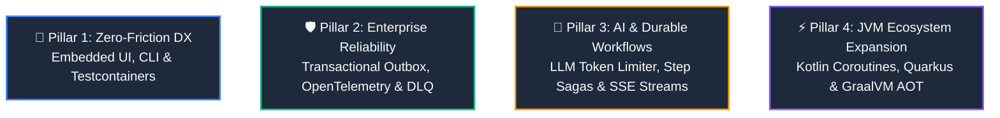

# 🗺️ OxMQ Strategic Roadmap (v1.1.0 — v2.0.0+)

**Vision:** Elevate OxMQ from 100% BullMQ wire-parity to the **standard distributed job queue and durable workflow engine for Java 21+ and modern polyglot ecosystems**.

---

## 🎯 Adoption Thesis & Strategic Goals

OxMQ `v1.0.0` successfully delivered:
- **100% BullMQ v5 wire & functional parity** with 49 official Lua scripts.
- **Java 21 Project Loom Virtual Threads** for non-blocking concurrent worker scaling.
- **Spring Boot 3 starter** with declarative `@OxmqListener` and Actuator telemetry.
- **Microsecond benchmarks** and polyglot Bull-Board interoperability.

To drive mass developer adoption across startups and large enterprise organizations, OxMQ is expanding to solve the primary architectural and operational pain points of modern distributed task processing:

1. **Zero-Infrastructure Dashboard**: Eliminating the friction of external Node.js/Docker runtimes by serving an embedded UI directly from the Java application.
2. **Transactional Outbox Pattern**: Guaranteeing atomic state between relational database mutations (PostgreSQL/MySQL) and job queueing in Redis.
3. **End-to-End Observability**: Standardizing on W3C Distributed Tracing and OpenTelemetry across asynchronous queue boundaries.
4. **AI & LLM Workflows**: Purpose-built rate limiting for Token-Bucket constraints (Requests Per Minute + Tokens Per Minute) and streaming progress.
5. **Modern JVM Runtimes**: First-class idiomatic Kotlin Coroutines DSL and Quarkus / GraalVM Native Image AOT compilation.

---

## 🏛️ The 4 Strategic Pillars



---

### 🎨 Pillar 1: Zero-Friction Developer Experience (Embedded DX)

#### 1.1 `oxmq-ui`: Zero-Node.js Embedded Web Dashboard (`oxmq-spring-boot-starter-ui`)
* **Problem**: Bull-Board requires running an auxiliary Node.js/Docker container, which creates friction in pure Java organizations and local development.
* **Solution**: A zero-dependency embedded dashboard served directly by Spring Boot (at `/oxmq/ui` or via Spring Boot Actuator):
  - Bundled lightweight HTML5 / HTMX web assets inside a single Maven JAR.
  - Live queue counters (Wait, Active, Delayed, Completed, Failed).
  - Interactive job inspector: View payload, timestamps, progress, and exception stack traces.
  - 1-click management: Retry failed jobs, delete jobs, pause/resume queues, and trigger ad-hoc manual jobs.
  - DAG workflow visualization for `FlowProducer` dependency trees.

#### 1.2 `oxmq-testcontainers`: Zero-Boilerplate Integration Testing
* **Problem**: Setting up clean, deterministic Redis integration tests requires repetitive container setup and queue purging.
* **Solution**: Dedicated testing library `io.oxmq:oxmq-testcontainers`:
  ```java
  @OxmqTest
  @Testcontainers
  class OrderWorkerIntegrationTest {
      @Autowired
      private OxmqQueue<Order> queue;

      @Test
      void shouldProcessJobOnVirtualThread() {
          Job<Order> job = queue.add("process", new Order("ord_101", 99.0));
          await().until(() -> queue.getJobState(job.getId()) == JobState.COMPLETED);
      }
  }
  ```
  Automatically manages container lifecycles, purges queues between tests, and provides fluent assertions (`assertThat(queue).hasActiveJobs(0)`).

#### 1.3 `oxmq-cli`: Interactive Terminal Dashboard (TUI)
* **Solution**: A standalone, keyboard-driven terminal dashboard (similar to `k9s` or `lazygit`) distributed via Homebrew, JBang, or native binary:
  - Real-time event tailing across queues.
  - Quick cluster health check and instant queue drains without opening a browser.

---

### 🛡️ Pillar 2: Enterprise Reliability & Architecture Patterns

#### 2.1 `oxmq-outbox`: Native Transactional Outbox Pattern
* **Problem**: The classic distributed dual-write hazard:
  ```java
  @Transactional
  public void placeOrder(Order order) {
      orderRepository.save(order);      // 1. Saved to relational DB
      queue.add("send-receipt", order);  // 2. Sent to Redis
      // If payment validation fails or DB commit rolls back, the job STILL runs in Redis!
  }
  ```
* **Solution**: Provide `oxmq-outbox` with Spring `@TransactionalEventListener` and JDBC / JPA / R2DBC outbox table support:
  - Jobs are saved to an `oxmq_outbox` relational table in the *same* local database transaction.
  - On transaction commit, a lightweight Loom Virtual Thread dispatcher immediately delivers the job to Redis with sub-millisecond latency.
  - Guarantees **Atomic Enqueueing**: Zero phantom jobs on rollbacks, and zero lost jobs during Redis network blips.

#### 2.2 `oxmq-tracing`: W3C Distributed Tracing & OpenTelemetry
* **Solution**: Full distributed trace propagation across asynchronous boundaries:
  - Automatically captures W3C `traceparent` and `tracestate` into job metadata on `queue.add()`.
  - Worker automatically restores the trace context and starts a child span for the job execution.
  - Native integration with Micrometer Tracing, OpenTelemetry SDK, Datadog, Jaeger, Zipkin, and Grafana Tempo.
  - Allows end-to-end trace visualization from user HTTP request $\rightarrow$ Redis queue $\rightarrow$ Loom Worker $\rightarrow$ Downstream APIs/Databases.

#### 2.3 DLQ Intelligent Auto-Triage & Human-in-the-Loop Replay
* **Solution**:
  - Configurable dead-letter alerting sinks (Slack, Discord, PagerDuty, Webhooks) when a job exhausts all retries.
  - Automated exception classification: Groups failures by root cause.
  - Payload editing in the UI: Correct malformed inputs and replay without direct database intervention.

---

### 🤖 Pillar 3: AI & Durable Workflows

#### 3.1 LLM Token-Bucket Dual Rate Limiter (RPM + TPM)
* **Problem**: AI workloads calling LLM providers (OpenAI, Anthropic, Google Gemini, Ollama) must respect two simultaneous rate limits:
  1. Requests per minute (RPM)
  2. Tokens per minute (TPM)
* **Solution**: An AI-native dual sliding-window token bucket in OxMQ:
  ```java
  JobOptions.builder()
      .rateLimitKey("openai-gpt4")
      .estimatedTokens(1500) // Consumes 1 request AND 1,500 tokens from the sliding window
      .build();
  ```
  If token capacity is depleted, OxMQ automatically delays the job to the next sliding window without thread blocking or failed attempts.

#### 3.2 Real-time Progress Streaming (SSE / WebSockets)
* **Solution**:
  - `job.updateProgress(chunk)` pushes directly to Redis Streams.
  - Built-in Spring WebFlux / Spring MVC reactive endpoint helper (`oxmq.streamProgress(jobId)`) producing Server-Sent Events (SSE) so frontends can render real-time progress bars or token streams.

#### 3.3 Durable Step Functions (Lightweight Sagas)
* **Solution**: Evolve `FlowProducer` into an intuitive Step Function API with intermediate state checkpointing:
  ```java
  workflow.step("extract-audio", () -> extractAudio(videoUrl))
          .step("transcribe-llm", audio -> transcribe(audio))
          .sleep(Duration.ofMinutes(5)) // Checkpointed durable pause
          .step("notify-completion", transcript -> sendEmail(transcript));
  ```
  If a worker crashes mid-workflow, only the uncompleted step resumes upon recovery.

---

### ⚡ Pillar 4: Modern JVM Ecosystem Expansion

#### 4.1 `oxmq-kotlin`: Idiomatic Kotlin Coroutines & DSL
* **Solution**:
  - Clean type-safe Kotlin builder DSL:
    ```kotlin
    val queue = oxmqQueue<Order>("orders") {
        defaultOptions {
            attempts = 5
            backoff = Exponential(1.seconds)
        }
    }

    oxmqWorker<Order>("orders", concurrency = 50) { job ->
        // Suspending function! Natively integrates with Kotlin coroutines & Loom
        processOrderSuspending(job.data)
    }
    ```

#### 4.2 `quarkus-oxmq` & GraalVM Native Image Compilation
* **Solution**:
  - A first-class Quarkus extension (`quarkus-oxmq`) with build-time reflection registration.
  - Out-of-the-box GraalVM `native-image` compilation support for both Spring Boot 3 AOT and Quarkus for sub-10ms container cold starts.

---

## 📅 Phased Release Horizons

| Release | Focus Area | Key Deliverables | Status |
| :---: | :--- | :--- | :---: |
| **`v1.0.0`** | **Core Foundation & Wire Parity** | • 49 BullMQ Lua scripts<br/>• Loom Virtual Threads dispatcher<br/>• `FlowProducer` DAGs & Batch dequeue<br/>• Spring Boot 3 starter & Bull-Board interoperability | 🟢 Released |
| **`v1.1.0`** | **Zero-Friction DX & Tooling** | • `oxmq-spring-boot-starter-ui` (Zero-Node.js Dashboard)<br/>• `oxmq-testcontainers` (JUnit 5 extension)<br/>• W3C OpenTelemetry Distributed Tracing | 🟡 Planned |
| **`v1.2.0`** | **Enterprise Reliability** | • `oxmq-outbox` (Transactional Outbox for Spring/JPA)<br/>• DLQ Webhook / Slack Alerts & Human-in-the-loop replay<br/>• Redis Cluster hash-tag audit & Valkey 8 certification | ⚪ Planned |
| **`v1.3.0`** | **Kotlin & Cloud-Native** | • `oxmq-kotlin` Coroutines DSL<br/>• GraalVM Native Image (AOT) hints & verification<br/>• Quarkus Extension exploration | ⚪ Planned |
| **`v2.0.0`** | **AI Orchestration & Sagas** | • AI Dual-Rate Limiter (RPM + TPM token buckets)<br/>• SSE Progress Streaming endpoints<br/>• Durable Checkpointed Step Sagas | ⚪ Planned |

---

## 🤝 Community Feedback & Contributions

Have thoughts or additional requirements?
- Open a feature discussion on [GitHub Discussions](https://github.com/gaurav10610/oxmq/discussions).
- Check the [Contributing Guide](/attribution) to get involved.
