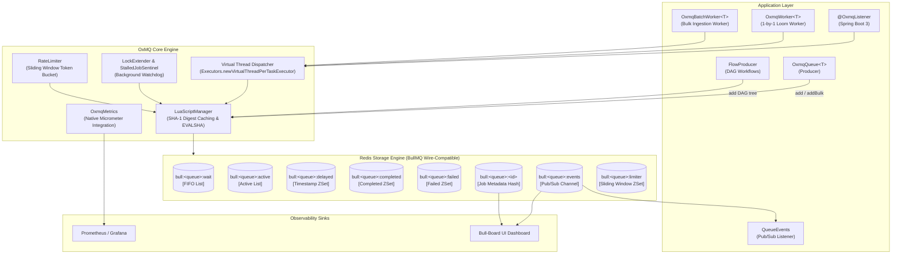
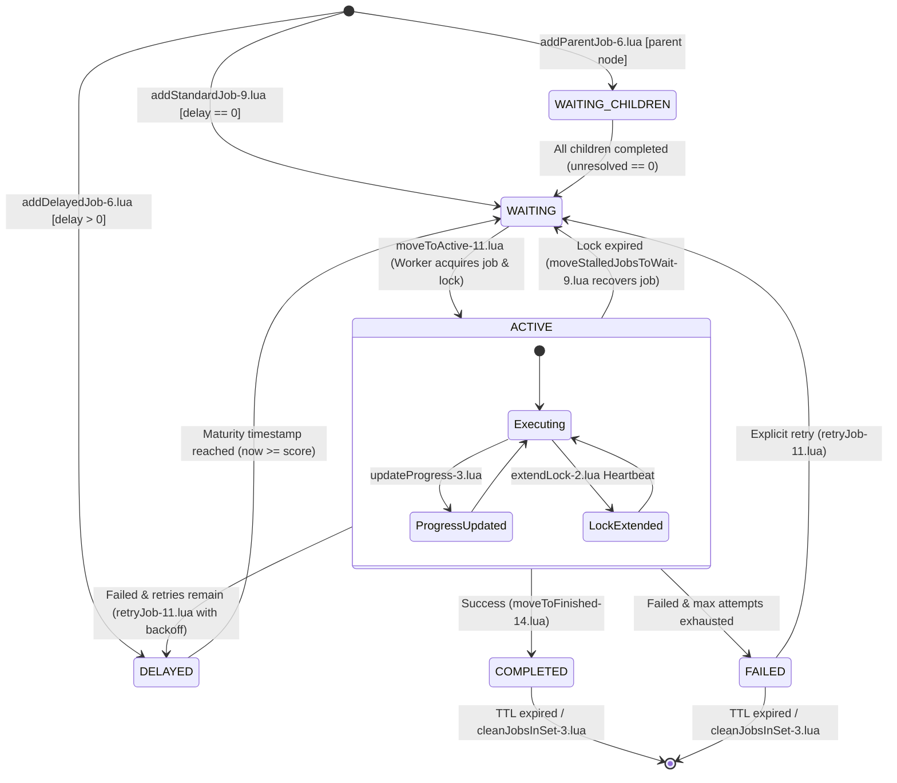
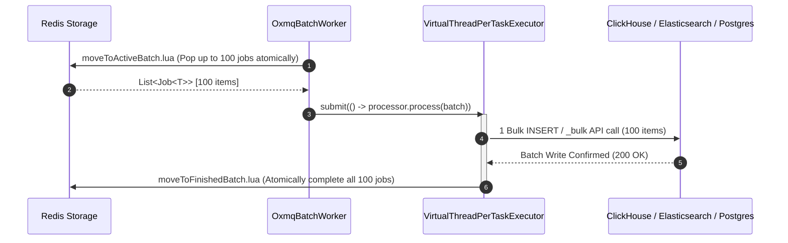
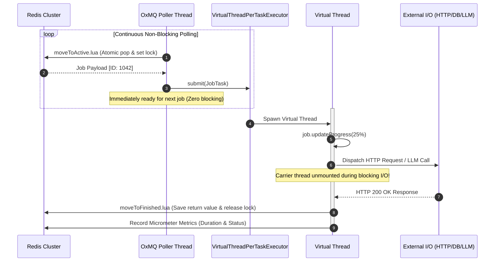
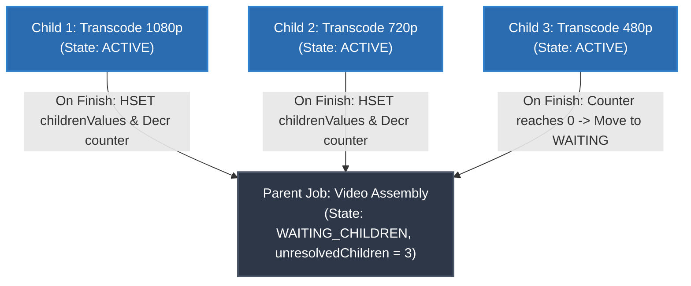
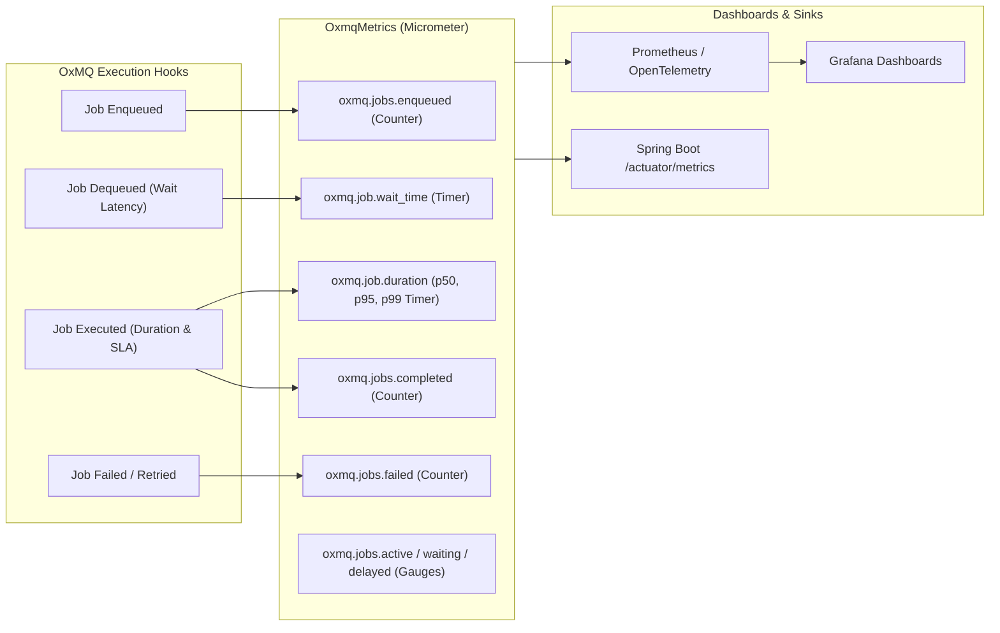

# 🏛️ OxMQ Architecture & Internals

This document details the architectural design, Redis data structures, concurrency model, DAG execution engine, Batch Dequeue pipeline, and performance telemetry in **OxMQ**.

---

## 1. High-Level System Architecture

OxMQ is engineered around 5 core pillars:
1. **Atomic Redis State Transitions:** All state transitions (`WAITING` $\rightarrow$ `ACTIVE` $\rightarrow$ `COMPLETED` / `FAILED` / `DELAYED`) execute via single-roundtrip Lua scripts.
2. **Virtual Thread Native (Project Loom):** Every task execution runs in an ultra-lightweight Java 21 Virtual Thread, enabling 1,000+ to 10,000+ concurrent I/O-bound workers with near-zero memory overhead.
3. **High-Throughput Batch Dequeue:** Bulk pop up to $N$ jobs atomically in 1 Redis call for fast database ingestion (ClickHouse, Elasticsearch, PostgreSQL batch inserts).
4. **BullMQ v5 Wire-Compatibility:** Standard BullMQ Redis key hierarchies enable seamless polyglot interoperability with Node.js/Python workers and instant compatibility with **Bull-Board UI**.
5. **Native Performance Instrumentation:** Microsecond-resolution Micrometer timers, gauges, and counters built into the core path.

---

## 2. Job Lifecycle State Machine

Jobs transition through a strictly enforced, atomic state machine managed by official BullMQ Redis Lua scripts:

  

---

## 3. High-Throughput Batch Dequeue Architecture

For high-volume data pipelines (e.g. audit logs, clickstream events, metrics ingestion into ClickHouse, Elasticsearch, or PostgreSQL), OxMQ provides **Batch Dequeue**:

---

## 4. Virtual Thread Concurrency Model

Unlike traditional thread pools that exhaust operating system carrier threads when tasks perform blocking I/O (HTTP calls, DB queries, LLM inferences), OxMQ leverages Java 21 **Virtual Threads (Project Loom)**:

---

## 5. Parent-Child DAG Workflow Engine (`FlowProducer`)

OxMQ supports complex task trees where parent tasks dynamically activate and consume the results of their children:

  

---

## 6. Native Performance Telemetry Pipeline

---

## 7. Official BullMQ Lua Script Engine & Key Topology

OxMQ directly incorporates all 49 official standalone Lua scripts from **BullMQ v5**. By executing the exact same Lua state transitions as BullMQ, OxMQ guarantees 100% wire and functional compatibility:

### Key Topology (`QueueKeys`)
| Key | Redis Type | Purpose |
| :--- | :--- | :--- |
| `bull:<queue>:wait` | LIST / STREAM | Pending jobs waiting to be claimed by workers |
| `bull:<queue>:active` | LIST | Currently executing jobs locked by workers |
| `bull:<queue>:delayed` | ZSET | Jobs scheduled for future timestamps (`score = timestamp`) |
| `bull:<queue>:waiting-children` | ZSET | Parent jobs waiting for dependencies to complete |
| `bull:<queue>:completed` | ZSET | Successfully finished jobs |
| `bull:<queue>:failed` | ZSET | Failed jobs that have exhausted all retries |
| `bull:<queue>:<jobId>` | HASH | Job metadata, payload, opts, stacktrace, progress |
| `bull:<queue>:<jobId>:lock` | STRING | Worker ownership token with lock lease TTL |
| `bull:<queue>:events` | STREAM / PUBSUB | Real-time state transition events |

### MessagePack Binary Protocol (`BullMsgPack`)
BullMQ scripts unpack complex arguments (`opts`, `jobArgs`) using `cmsgpack.unpack(ARGV[i])`. OxMQ encodes these options into binary MessagePack format using Jackson's MessagePack format and maps key names using BullMQ's option compression table (`fpof` for `failParentOnFailure`, `cpof` for `continueParentOnFailure`, `idof` for `ignoreDependencyOnFailure`, etc.).

---

## 🙏 Attribution

OxMQ builds upon the foundational queue architecture developed by the open-source **[BullMQ](https://github.com/taskforcesh/bullmq)** community. The official BullMQ Lua scripts are included under the permissive MIT license in [`BULLMQ_ATTRIBUTION.md`](https://github.com/gaurav10610/oxmq/blob/main/oxmq-core/src/main/resources/lua/BULLMQ_ATTRIBUTION.md).

---

## 👤 Architect & Author

**Gaurav Kumar Yadav**
* 💼 **LinkedIn:** [linkedin.com/in/gaurav-kumar-yadav-6125817a](https://www.linkedin.com/in/gaurav-kumar-yadav-6125817a/)
* 🐙 **GitHub:** [@gaurav10610](https://github.com/gaurav10610)

