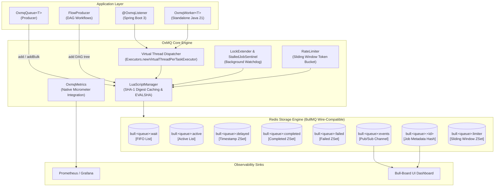
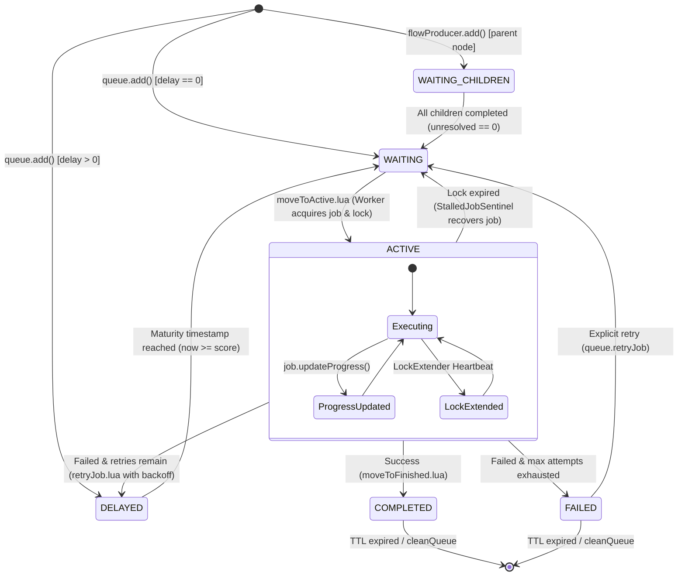
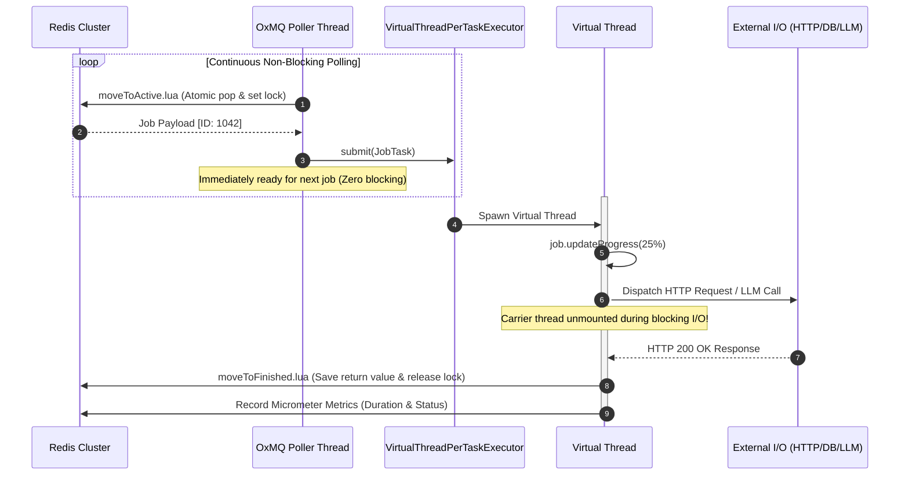
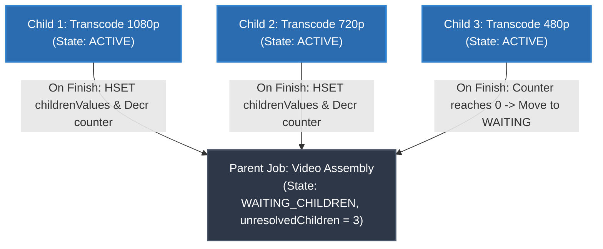
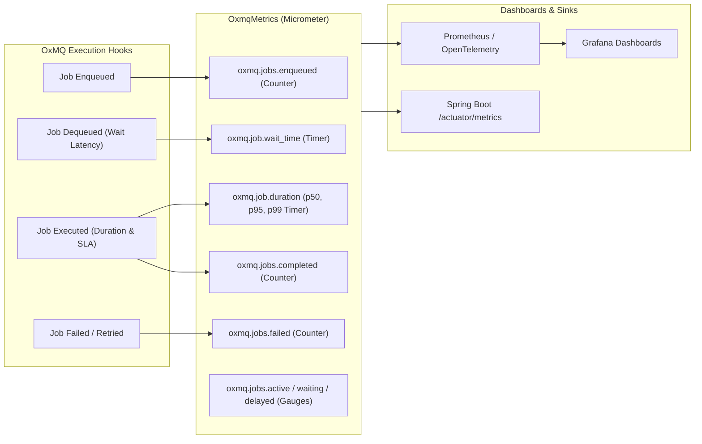

# 🏛️ OxMQ Architecture & Internals

This document details the architectural design, Redis data structures, concurrency model, DAG execution engine, and performance telemetry pipeline of **OxMQ**.

---

## 1. High-Level System Architecture

OxMQ is engineered around 4 core principles:
1. **Atomic Redis State Transitions:** All state transitions (`WAITING` $\rightarrow$ `ACTIVE` $\rightarrow$ `COMPLETED` / `FAILED` / `DELAYED`) are executed via single-roundtrip Lua scripts.
2. **Virtual Thread Native (Project Loom):** Every task execution runs in an ultra-lightweight Java 21 Virtual Thread, enabling 1,000+ to 10,000+ concurrent I/O-bound workers with near-zero memory overhead.
3. **BullMQ v5 Wire-Compatibility:** Standard BullMQ Redis key hierarchies enable seamless polyglot interoperability with Node.js/Python workers and instant compatibility with **Bull-Board UI**.
4. **Native Performance Instrumentation:** Microsecond-resolution Micrometer timers, gauges, and counters built into the core path.

---

## 2. Job Lifecycle State Machine

Jobs transition through a strictly enforced, atomic state machine managed by Redis Lua scripts:

---

## 3. Concurrency & Virtual Thread Execution Model

Unlike traditional thread pools that exhaust operating system carrier threads when tasks perform blocking I/O (HTTP calls, DB queries, LLM inferences), OxMQ leverages Java 21 **Virtual Threads (Project Loom)**:

---

## 4. Parent-Child DAG Workflow Engine (`FlowProducer`)

OxMQ supports complex task trees where parent tasks dynamically activate and consume the results of their children:

### Execution Flow:
1. `FlowProducer.add(tree)` writes child jobs to `bull:<q>:wait` and the parent job to `bull:<q>:<parentId>` with state `WAITING_CHILDREN` and `unresolvedChildrenCount = N`.
2. When each child completes, `moveToFinished.lua` stores the child's return value into `bull:<parentQueue>:<parentId>:childrenValues` and atomically decrements the unresolved count.
3. When `unresolvedChildrenCount` reaches `0`, Redis moves the parent job to `bull:<parentQueue>:wait` for immediate execution.

---

## 5. Redis Data Structure Layout (BullMQ Wire-Compatibility)

For a queue named `notifications`, OxMQ manages the following Redis keys:

| Key Pattern | Redis Type | Description |
| :--- | :--- | :--- |
| `bull:notifications:id` | `String` | Monotonically increasing atomic ID generator. |
| `bull:notifications:wait` | `List` | FIFO list of job IDs ready for immediate consumption. |
| `bull:notifications:active` | `List` | Job IDs currently being processed by active workers. |
| `bull:notifications:delayed` | `Sorted Set` | Delayed job IDs sorted by millisecond execution timestamp. |
| `bull:notifications:completed` | `Sorted Set / List` | Completed job IDs sorted by completion timestamp. |
| `bull:notifications:failed` | `Sorted Set / List` | Failed job IDs with error reasons. |
| `bull:notifications:stalled` | `Sorted Set` | Watchdog lock verification keys. |
| `bull:notifications:meta` | `Hash` | Queue metadata (paused state, rate limit settings). |
| `bull:notifications:limiter` | `Sorted Set` | Sliding window timestamps for rate limiting. |
| `bull:notifications:<jobId>` | `Hash` | Job fields: `name`, `data`, `opts`, `progress`, `returnvalue`, `failedReason`. |
| `bull:notifications:<jobId>:lock` | `String` | Ephemeral worker ownership lock with TTL (`lockDuration`). |
| `bull:notifications:<jobId>:logs` | `List` | Appended log messages for visual debugging. |

---

## 6. Native Performance Telemetry Pipeline

