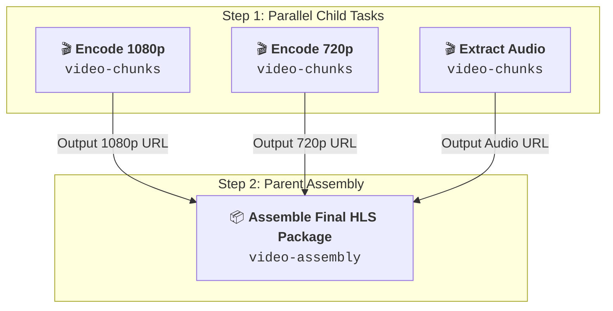

# 🌲 Parent-Child DAG Workflows Guide

**OxMQ** includes built-in, 100% free support for **Directed Acyclic Graph (DAG) Workflows** via `FlowProducer`. Unlike other Java workflow engines that lock DAG execution behind commercial paywalls (such as JobRunr Pro), OxMQ provides native multi-stage dependency trees out-of-the-box.

---

## 🎯 What is a Parent-Child DAG Workflow?

A DAG workflow represents a pipeline of interdependent background jobs where:
1. **Child jobs** execute first in parallel across distributed workers.
2. The **Parent job** automatically remains in a waiting state until **all** child jobs complete successfully.
3. If any child job fails, the parent job is automatically notified and fails or can trigger compensatory logic.
4. Child job return values are aggregated and passed directly to the parent job processor.



---

## 🛠️ Step-by-Step Implementation

### 1. Define Payloads

```java
public record VideoChunkTask(String videoId, String resolution, String chunkFile) {}
public record VideoAssemblyTask(String videoId, String title) {}
```

### 2. Construct and Submit the DAG with `FlowProducer`

```java
import io.oxmq.flow.FlowJobNode;
import io.oxmq.flow.FlowProducer;
import io.oxmq.model.JobNode;

FlowProducer flowProducer = new FlowProducer("redis://localhost:6379");

// 1. Define parallel child tasks
FlowJobNode child1 = FlowJobNode.builder()
        .queueName("video-chunks")
        .name("encode-1080p")
        .data(new VideoChunkTask("vid_456", "1080p", "chunk_0.mp4"))
        .build();

FlowJobNode child2 = FlowJobNode.builder()
        .queueName("video-chunks")
        .name("encode-720p")
        .data(new VideoChunkTask("vid_456", "720p", "chunk_1.mp4"))
        .build();

FlowJobNode child3 = FlowJobNode.builder()
        .queueName("video-chunks")
        .name("extract-audio")
        .data(new VideoChunkTask("vid_456", "aac", "chunk_audio.mp4"))
        .build();

// 2. Define parent task with child dependencies
FlowJobNode parentFlow = FlowJobNode.builder()
        .queueName("video-assembly")
        .name("assemble-hls-stream")
        .data(new VideoAssemblyTask("vid_456", "Product Launch 2026"))
        .children(List.of(child1, child2, child3))
        .build();

// 3. Atomically enqueue DAG into Redis
JobNode tree = flowProducer.add(parentFlow);
System.out.println("Enqueued DAG parent job: " + tree.getJob().getId());
```

---

## ⚡ 3. Processing Children and Parent Tasks

### Child Worker (`video-chunks`)
```java
OxmqWorker<VideoChunkTask> childWorker = OxmqWorker.<VideoChunkTask>builder()
        .queueName("video-chunks")
        .redisUri("redis://localhost:6379")
        .concurrency(50)
        .processor(job -> {
            VideoChunkTask chunk = job.getData();
            job.log("Encoding " + chunk.resolution() + " for " + chunk.videoId());
            // Simulate video encoding
            return "s3://cdn.video.com/" + chunk.videoId() + "/" + chunk.resolution() + ".mp4";
        })
        .build();

childWorker.start();
```

### Parent Worker (`video-assembly`)
The parent worker will only receive the job **after all 3 child tasks complete**:

```java
OxmqWorker<VideoAssemblyTask> parentWorker = OxmqWorker.<VideoAssemblyTask>builder()
        .queueName("video-assembly")
        .redisUri("redis://localhost:6379")
        .concurrency(10)
        .processor(job -> {
            VideoAssemblyTask task = job.getData();
            job.log("All child encoding tasks finished! Generating HLS master playlist for " + task.title());
            return "s3://cdn.video.com/" + task.videoId() + "/master.m3u8";
        })
        .build();

parentWorker.start();
```

---

## 🔄 Dynamic Multi-Tier Subtrees (Deep Hierarchies)

You can nest child flows arbitrarily deep: Grandparent $\to$ Parents $\to$ Children:

```
Grandparent (Send Email Report)
  └── Parent 1 (Generate Sales Analytics)
  │     ├── Child 1A (Scrape Region North)
  │     └── Child 1B (Scrape Region South)
  └── Parent 2 (Generate Inventory Analytics)
        ├── Child 2A (Warehouse East)
        └── Child 2B (Warehouse West)
```

Each tier will strictly await all underlying subtrees before advancing upstream.

---

## 🛡️ Failure Propagation & Circuit Breaking

If a child task exhausts all its retry attempts and fails:
1. The child enters the `failed` state in Redis.
2. The parent job is automatically notified via the Lua state machine.
3. The parent is marked as failed without executing, preventing inconsistent or corrupt downstream state.
