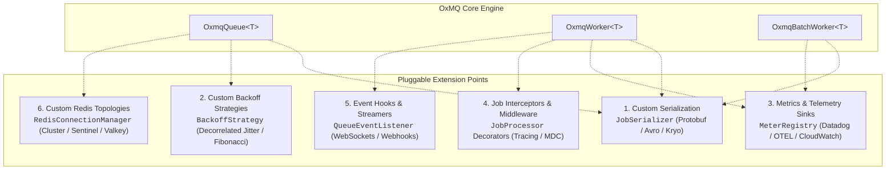

# 🧩 OxMQ Extensibility Guide

Yes! **OxMQ is designed with a pluggable, modular SPI (Service Provider Interface) architecture.** Every major layer—from serialization, retry backoffs, metrics, Redis topology, to job execution middleware—can be customized or swapped out without modifying the core engine.

---

## 🏗️ Architectural Extension Points



---

## 🛠️ 1. Custom Serialization (`JobSerializer`)

By default, OxMQ uses [`JacksonJobSerializer`](../oxmq-core/src/main/java/io/oxmq/serializer/JacksonJobSerializer.java) for JSON. You can implement [`JobSerializer`](../oxmq-core/src/main/java/io/oxmq/serializer/JobSerializer.java) to support **Protobuf, Apache Avro, Kryo, MessagePack, or AES-Encrypted Payloads**:

```java
public class EncryptedJobSerializer implements JobSerializer {

    private final JacksonJobSerializer delegate = new JacksonJobSerializer();
    private final EncryptionService encryptionService;

    public EncryptedJobSerializer(EncryptionService encryptionService) {
        this.encryptionService = encryptionService;
    }

    @Override
    public String serialize(Object object) {
        String plainJson = delegate.serialize(object);
        return encryptionService.encrypt(plainJson);
    }

    @Override
    public <T> T deserialize(String encryptedPayload, Class<T> targetClass) {
        String plainJson = encryptionService.decrypt(encryptedPayload);
        return delegate.deserialize(plainJson, targetClass);
    }

    @Override
    public <T> T deserialize(String encryptedPayload, TypeReference<T> typeReference) {
        String plainJson = encryptionService.decrypt(encryptedPayload);
        return delegate.deserialize(plainJson, typeReference);
    }
}
```

### Usage
```java
OxmqQueue<SensitiveData> queue = OxmqQueue.<SensitiveData>builder()
        .name("sensitive-tasks")
        .serializer(new EncryptedJobSerializer(encryptionService))
        .build();
```

---

## 🔄 2. Custom Retry & Backoff Algorithms (`BackoffStrategy`)

OxMQ includes `Fixed` and `Exponential` backoff strategies. You can implement custom backoff algorithms such as **Decorrelated Full Jitter** or **Fibonacci Backoff**:

```java
public record DecorrelatedJitterBackoff(long baseDelayMs, long maxDelayMs) implements BackoffStrategy {

    private static final ThreadLocalRandom RANDOM = ThreadLocalRandom.current();

    @Override
    public long calculateDelayMs(int attemptsMade) {
        long temp = Math.min(maxDelayMs, baseDelayMs * (1L << Math.min(attemptsMade, 30)));
        long sleep = RANDOM.nextLong(baseDelayMs, temp + 1);
        return Math.min(maxDelayMs, sleep);
    }
}
```

### Usage
```java
queue.add("webhook", payload, JobOptions.builder()
        .attempts(5)
        .backoff(new DecorrelatedJitterBackoff(1000, 60000))
        .build());
```

---

## 📊 3. Pluggable Metrics & Telemetry Sinks (Micrometer)

OxMQ's [`OxmqMetrics`](../oxmq-core/src/main/java/io/oxmq/metrics/OxmqMetrics.java) engine wraps Micrometer's `MeterRegistry`. You can route OxMQ metrics to any enterprise monitoring backend:

```java
// OpenTelemetry / Datadog / CloudWatch / InfluxDB
MeterRegistry datadogRegistry = new DatadogMeterRegistry(config, Clock.SYSTEM);

OxmqWorker<Task> worker = OxmqWorker.<Task>builder()
        .queueName("tasks")
        .metrics(new OxmqMetrics(datadogRegistry))
        .build();
```

---

## 🛡️ 4. Job Interceptors & Middleware (Tracing & MDC)

You can decorate `JobProcessor` functional interfaces with custom cross-cutting middleware (Distributed Tracing, MDC injection, Tenant Context, Security Authentication):

```java
public class TracingMiddleware {

    public static <T, R> JobProcessor<T, R> withTracing(JobProcessor<T, R> inner) {
        return job -> {
            String traceId = job.getId();
            MDC.put("traceId", traceId);
            MDC.put("queue", job.getName());
            try {
                return inner.process(job);
            } finally {
                MDC.clear();
            }
        };
    }
}
```

### Usage
```java
OxmqWorker<EmailTask> worker = OxmqWorker.<EmailTask>builder()
        .queueName("emails")
        .processor(TracingMiddleware.withTracing(job -> {
            log.info("Processing with MDC traceId automatically populated!");
            return "DONE";
        }))
        .build();
```

---

## 📡 5. Real-Time Event Hooks (`QueueEvents` / `QueueEventListener`)

Stream job lifecycle events to WebSockets, Slack channels, or Apache Kafka:

```java
QueueEvents events = new QueueEvents("orders", redisUri);

events.addListener(new QueueEventListener() {
    @Override
    public void onCompleted(String jobId, String result) {
        webSocketBroadcaster.broadcast("/topic/orders", Map.of("jobId", jobId, "status", "COMPLETED"));
    }

    @Override
    public void onFailed(String jobId, String failedReason) {
        slackAlertService.sendAlert("🚨 Order Job " + jobId + " failed: " + failedReason);
    }

    @Override
    public void onProgress(String jobId, int progress) {
        webSocketBroadcaster.broadcast("/topic/orders/progress", Map.of("jobId", jobId, "progress", progress));
    }
});
```

---

## 🗄️ 6. Custom Redis Topologies & Clusters

OxMQ works across any Redis infrastructure:
* **Standalone Redis** (`redis://localhost:6379`)
* **Redis Cluster** (AWS ElastiCache, Azure Redis)
* **Redis Sentinel** (High-availability master/replica with auto-failover)
* **Valkey / KeyDB** (Drop-in open-source alternatives)
* **Custom Lettuce Connection Poolers**
