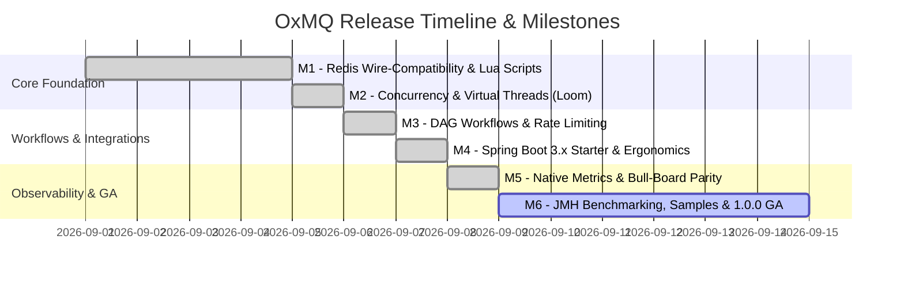

# 🗺️ Project Roadmap

**Project:** `OxMQ` (High-Performance Distributed Job & Workflow Engine for Java 21+)  
**Version Strategy:** Semantic Versioning (`v0.1.0` $\rightarrow$ `v1.0.0` GA)  
**Target Completion:** 6 Core Milestones  

---

## 1. Visual Roadmap Overview

---

## 2. Milestone Breakdown & Deliverables

### ✅ Milestone 1: Foundation & Redis Wire-Compatibility (`v0.1.0`)
* **Goal:** Multi-module Maven setup, Lettuce Redis transport, and BullMQ v5 compatible atomic Lua scripts.
* **Key Deliverables:**
  * Multi-module project setup (`oxmq-core`, `oxmq-spring-boot-starter`, `oxmq-benchmarks`, `oxmq-samples`).
  * Atomic Lua scripts: `addJob.lua`, `moveToActive.lua`, `moveToFinished.lua`, `retryJob.lua`, `extendLock.lua`, `cleanQueue.lua`, `pauseQueue.lua`, `rateLimit.lua`, `obliterate.lua`.
  * `Queue<T>`, `Worker<T>`, and `Job<T>` builder APIs.
  * Jackson JSON serialization engine supporting Java 21 Records and JSR-310 dates.

---

### ✅ Milestone 2: Concurrency, Virtual Threads & Robustness (`v0.2.0`)
* **Goal:** High-throughput task execution engine with Java 21 Virtual Threads (Loom) and production resilience.
* **Key Deliverables:**
  * Virtual Thread-per-task dispatcher (`Executors.newVirtualThreadPerTaskExecutor()`).
  * Semaphore-controlled concurrency limiting.
  * `LockExtender` heartbeat thread for long-running jobs.
  * `StalledJobSentinel` watchdog scanning for orphaned active jobs.
  * Configurable exponential, fixed, and custom backoff strategies.
  * Real-time progress updates (`job.updateProgress`) and execution logs (`job.log`).

---

### ✅ Milestone 3: Advanced Workflows & Rate Limiting (`v0.3.0`)
* **Goal:** BullMQ parent-child job hierarchies (DAGs) and sliding-window rate limiters.
* **Key Deliverables:**
  * `FlowProducer` engine: Hierarchical task trees where parent tasks await all child tasks.
  * Child result propagation into parent job context (`job.getChildrenValues()`).
  * Sliding-window token-bucket rate limiter per queue/key.
  * Queue controls: `pause()`, `resume()`, `clean()`, and `obliterate()`.

---

### ✅ Milestone 4: Spring Boot Integration & Developer Ergonomics (`v0.4.0`)
* **Goal:** Seamless, zero-friction developer experience for Spring Boot 3.x.
* **Key Deliverables:**
  * `@EnableOxmq` and Spring Boot Auto-Configuration (`OxmqAutoConfiguration`).
  * Declarative `@OxmqListener(queue = "...", concurrency = 50)` annotation.
  * `OxmqListenerAnnotationBeanPostProcessor` for worker lifecycle management.
  * Auto-bound `application.yml` properties (`OxmqProperties`).
  * Spring Boot Actuator health indicator (`OxmqHealthIndicator`).

---

### ✅ Milestone 5: Observability, Metrics & Bull-Board UI (`v0.5.0`)
* **Goal:** Instant visual inspection and enterprise metrics integration.
* **Key Deliverables:**
  * **Bull-Board Parity:** 100% wire-compatible with Node.js [Bull-Board](https://github.com/felixmosh/bull-board) UI.
  * **Native Micrometer Metrics:** Real-time counters, gauges, and timers (`p50`, `p95`, `p99` percentiles) for Prometheus and Grafana.
  * Queue depth gauges for `active`, `waiting`, and `delayed` job counts.

---

### 🚀 Milestone 6: Hardening, Benchmarks & 1.0.0 GA (`v1.0.0`)
* **Goal:** Production validation, high-throughput microbenchmarks, and official release.
* **Key Deliverables:**
  * JMH microbenchmarking suite (`oxmq-benchmarks`).
  * Standalone Java 21 Quickstart (`oxmq-sample-basic`) and Spring Boot 3 demo (`oxmq-sample-spring-boot`).
  * GitHub Actions CI pipeline testing across JDK 21 and Redis 7.
  * Maven Central publication readiness (`io.oxmq:oxmq-core`, `io.oxmq:oxmq-spring-boot-starter`).

---

## 3. Future Horizons (`v1.1.0+`)
* **GraalVM Native Image:** Native AOT compilation support for Quarkus & Micronaut.
* **Kotlin Coroutines DSL:** Idiomatic Kotlin worker syntax (`suspend fun process(...)`).
* **S3 / Blob Storage Large Payload Spillover:** Automatic offloading of payloads $> 512\text{KB}$ to object storage.
