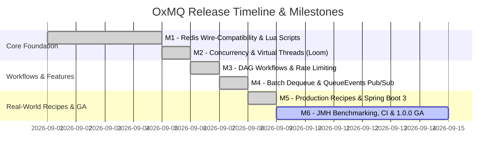

# 🗺️ Master Project Roadmap

**Project:** `OxMQ` (High-Performance Distributed Job & Workflow Engine for Java 21+)  
**Version Strategy:** Semantic Versioning (`v0.1.0` $\rightarrow$ `v1.0.0` GA)  
**Target Completion:** 6 Core Milestones  

---

## 1. Visual Roadmap & Release Milestones

---

## 2. Milestone Breakdown & Deliverables

### ✅ Milestone 1: Foundation & Redis Wire-Compatibility (`v0.1.0`)
* **Goal:** Multi-module Maven setup, Lettuce Redis transport, and BullMQ v5 compatible atomic Lua scripts.
* **Deliverables:**
  * Multi-module project setup (`oxmq-core`, `oxmq-spring-boot-starter`, `oxmq-benchmarks`, `oxmq-examples`).
  * Atomic Lua scripts: `addJob.lua`, `moveToActive.lua`, `moveToFinished.lua`, `retryJob.lua`, `extendLock.lua`, `cleanQueue.lua`, `pauseQueue.lua`, `rateLimit.lua`, `obliterate.lua`.
  * `Queue<T>`, `Worker<T>`, and `Job<T>` builder APIs.
  * Jackson JSON serialization engine supporting Java 21 Records and JSR-310 dates.

---

### ✅ Milestone 2: Concurrency, Virtual Threads & Robustness (`v0.2.0`)
* **Goal:** High-throughput task execution engine with Java 21 Virtual Threads (Loom) and production resilience.
* **Deliverables:**
  * Virtual Thread-per-task dispatcher (`Executors.newVirtualThreadPerTaskExecutor()`).
  * Semaphore-controlled concurrency limiting.
  * `LockExtender` heartbeat thread for long-running jobs.
  * `StalledJobSentinel` watchdog scanning for orphaned active jobs.
  * Configurable exponential, fixed, and custom backoff strategies.
  * Real-time progress updates (`job.updateProgress`) and execution logs (`job.log`).

---

### ✅ Milestone 3: Advanced Workflows & Rate Limiting (`v0.3.0`)
* **Goal:** BullMQ parent-child job hierarchies (DAGs) and sliding-window rate limiters.
* **Deliverables:**
  * `FlowProducer` engine: Hierarchical task trees where parent tasks await all child tasks.
  * Child result propagation into parent job context (`job.getChildrenValues()`).
  * Sliding-window token-bucket rate limiter per queue/key.
  * Queue controls: `pause()`, `resume()`, `clean()`, and `obliterate()`.

---

### ✅ Milestone 4: Batch Dequeue & Event Streaming (`v0.4.0`)
* **Goal:** High-throughput bulk popping for database ingestion and Pub/Sub event listeners.
* **Deliverables:**
  * `OxmqBatchWorker<T>` and `BatchJobProcessor<T, R>`: Pop up to $N$ jobs atomically in 1 Redis roundtrip.
  * `moveToActiveBatch.lua` and `moveToFinishedBatch.lua` atomic batch scripts.
  * `QueueEvents`: Redis Pub/Sub listener for real-time events (`onWaiting`, `onProgress`, `onCompleted`, `onFailed`, `onRetried`).

---

### ✅ Milestone 5: Flagship Showcase & Spring Boot 3 (`v0.5.0`)
* **Goal:** Production-grade developer showcase and seamless Spring Boot 3 auto-configuration.
* **Deliverables:**
  * Spring Boot 3 Starter with `@EnableOxmq`, declarative `@OxmqListener`, and Actuator health indicator.
  * Unified `cloudbridge` flagship application:
    1. Multi-Cloud Asset Sync Pipeline (GitHub $\rightarrow$ Dropbox / Box).
    2. Parent-Child DAG Workflows (`FlowProducer`) with automatic parent resolution upon child completion.
    3. Concurrency on Java 21 Virtual Threads (Loom).
    4. Real-time progress updates & per-child transfer state inspection.
    5. Modern interactive web dashboard (`http://localhost:8080`) with embedded Bull-Board inspector.

---

### 🚀 Milestone 6: Hardening, Benchmarking & 1.0.0 GA (`v1.0.0`)
* **Goal:** Production validation, high-throughput microbenchmarks, and official release.
* **Deliverables:**
  * JMH microbenchmarking suite (`oxmq-benchmarks`).
  * Multi-node Redis Sentinel & Cluster soak tests.
  * Maven Central publication (`io.oxmq:oxmq-core`, `io.oxmq:oxmq-spring-boot-starter`).

---

## 3. Future Horizons (`v1.1.0+`)
* **OpenTelemetry Context Propagation:** Distributed W3C `traceparent` context passed through job headers.
* **Large Payload S3/MinIO Spillover:** Automatic offloading of payloads $> 512\text{KB}$ to object storage.
* **GraalVM Native Image Support:** Native AOT compilation for Quarkus & Micronaut.
* **Dead-Letter Queue (DLQ) Replay CLI:** Tool to inspect and replay failed jobs in batches.
