# What is OxMQ?

**OxMQ** is an ultra-high-performance distributed message and job queue engine for **Java 21+** engineered with native **Project Loom Virtual Threads** and offering **100% wire and functional parity with BullMQ v5**.

It bridges the distributed queue gap in the Java enterprise ecosystem, unlocking virtual thread concurrency while maintaining zero-protocol friction with Redis and BullMQ ecosystems (including [Bull-Board](https://github.com/felixmosh/bull-board)).

---

## 💡 The Problem: The Java Queue Dilemma

Historically, Java developers building distributed task processing faced an awkward compromise:

1. **Heavyweight Message Brokers (Kafka / RabbitMQ)**: Outstanding for event streaming and pub/sub routing, but complex to operate when you need atomic job delayed retries, job parent-child DAGs, progress tracking, rate limiting, and ad-hoc job cancellations.
2. **Traditional Java Redis Queues**: Built for Java 8/11 with fixed OS thread pools (`FixedThreadPool`). When tasks perform blocking I/O (database queries, third-party REST APIs, LLM calls), thread pools quickly become saturated, driving up memory consumption and latency.
3. **Node.js BullMQ Parity Gap**: Teams using BullMQ in TypeScript/Node had no direct equivalent in Java with matching Redis key topologies and Lua scripts, preventing seamless polyglot architectures.

---

## ⚡ The Solution: OxMQ

OxMQ resolves this by pairing **Redis atomic Lua scripts** with **Java 21 Virtual Threads**:

- **Native Loom Concurrency**: Every worker task executes on a lightweight Virtual Thread (`Executors.newVirtualThreadPerTaskExecutor()`). Virtual threads unmount from carrier threads during blocking I/O, allowing single worker nodes to comfortably handle thousands of concurrent in-flight jobs.
- **49 Official BullMQ Lua Scripts**: Direct execution of battle-tested BullMQ v5 scripts for atomic job state transitions, locking, scheduling, and rate limiting.
- **Full BullMQ Wire Parity**: Uses standard `{prefix}:{queue}:*` Redis keys and MessagePack serialization, allowing instant plug-and-play with **Bull-Board UI** and cross-language producers/workers.
- **Spring Boot 3+ Integration**: Declarative `@OxmqListener` annotations, auto-configuration, and Spring Boot Actuator health checks.

---

## 🏛️ High-Level Architecture

```mermaid
graph TB
    subgraph App["Application Layer (Java 21+)"]
        Producer["OxmqQueue&lt;T&gt;<br/>(Producer API)"]
        Flow["FlowProducer<br/>(DAG Workflows)"]
        SpringListener["@OxmqListener<br/>(Spring Boot 3)"]
    end

    subgraph Engine["OxMQ Core Engine (Virtual Threads)"]
        Loom["Loom Task Dispatcher<br/>Executors.newVirtualThreadPerTaskExecutor()"]
        Watchdog["Lock Watchdog<br/>Auto-Extension Heartbeat"]
        Limiter["Rate Limiter<br/>Sliding Token Bucket"]
        Telemetry["OxmqMetrics<br/>Micrometer &amp; Streams"]
    end

    subgraph Redis["Redis Storage Engine (BullMQ Wire-Compatible)"]
        Wait["bull:&lt;queue&gt;:wait<br/>[FIFO List]"]
        Active["bull:&lt;queue&gt;:active<br/>[Active List]"]
        Delayed["bull:&lt;queue&gt;:delayed<br/>[Timestamp ZSet]"]
        Completed["bull:&lt;queue&gt;:completed<br/>[TTL ZSet]"]
        Failed["bull:&lt;queue&gt;:failed<br/>[Failed ZSet]"]
        JobHash["bull:&lt;queue&gt;:&lt;id&gt;<br/>[Job Metadata Hash]"]
        EventsStream["bull:&lt;queue&gt;:events<br/>[Redis Stream]"]
    end

    Producer -->|add / addBulk| Loom
    Flow -->|add DAG tree| Loom
    SpringListener --> Loom

    Loom -->|Claim / Finish| Wait
    Loom -->|Process| Active
    Loom -->|Schedule| Delayed
    Loom -->|Finish| Completed
    Loom -->|Fail| Failed
    Watchdog -.->|extendLock-2.lua| Active
    Limiter -.->|Token Bucket| Wait
    Loom -->|Metadata| JobHash
    Telemetry -->|XADD| EventsStream

    style App fill:#1e293b,stroke:#3b82f6,stroke-width:2px,color:#f8fafc
    style Engine fill:#1e293b,stroke:#f97316,stroke-width:2px,color:#f8fafc
    style Redis fill:#1e293b,stroke:#ef4444,stroke-width:2px,color:#f8fafc

    style Producer fill:#2563eb,stroke:#60a5fa,stroke-width:1px,color:#ffffff
    style Flow fill:#0284c7,stroke:#38bdf8,stroke-width:1px,color:#ffffff
    style SpringListener fill:#059669,stroke:#34d399,stroke-width:1px,color:#ffffff

    style Loom fill:#d97706,stroke:#fbbf24,stroke-width:1px,color:#ffffff
    style Watchdog fill:#b45309,stroke:#f59e0b,stroke-width:1px,color:#ffffff
    style Limiter fill:#b45309,stroke:#f59e0b,stroke-width:1px,color:#ffffff
    style Telemetry fill:#b45309,stroke:#f59e0b,stroke-width:1px,color:#ffffff

    style Wait fill:#dc2626,stroke:#f87171,stroke-width:1px,color:#ffffff
    style Active fill:#ea580c,stroke:#fb923c,stroke-width:1px,color:#ffffff
    style Delayed fill:#7c3aed,stroke:#a78bfa,stroke-width:1px,color:#ffffff
    style Completed fill:#16a34a,stroke:#4ade80,stroke-width:1px,color:#ffffff
    style Failed fill:#991b1b,stroke:#f87171,stroke-width:1px,color:#ffffff
    style JobHash fill:#475569,stroke:#94a3b8,stroke-width:1px,color:#ffffff
    style EventsStream fill:#475569,stroke:#94a3b8,stroke-width:1px,color:#ffffff
```

---

## 🎯 Next Steps

- Check out the [Quickstart Guide](/guide/quickstart) to build your first queue and worker.
- Explore the [Spring Boot 3+ Starter](/guide/spring-boot) for declarative `@OxmqListener` usage.
- Read about [Project Loom Virtual Threads](/guide/virtual-threads) and concurrency management.
